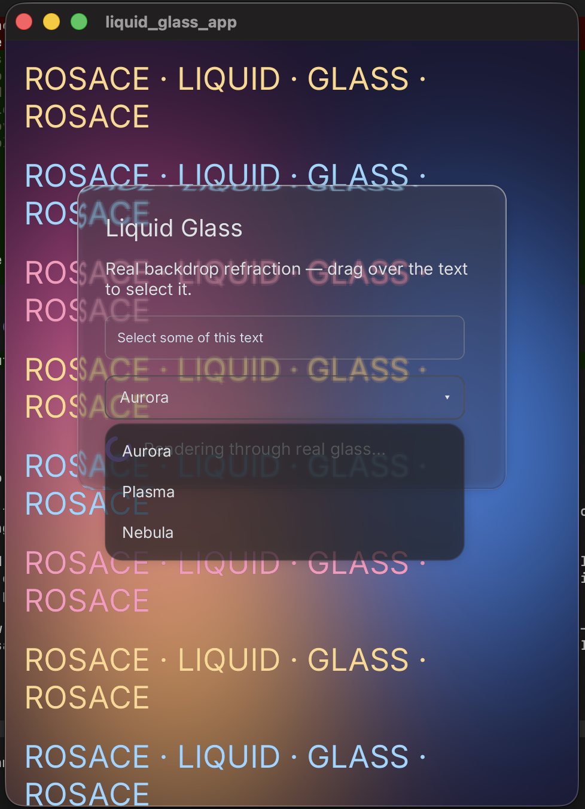
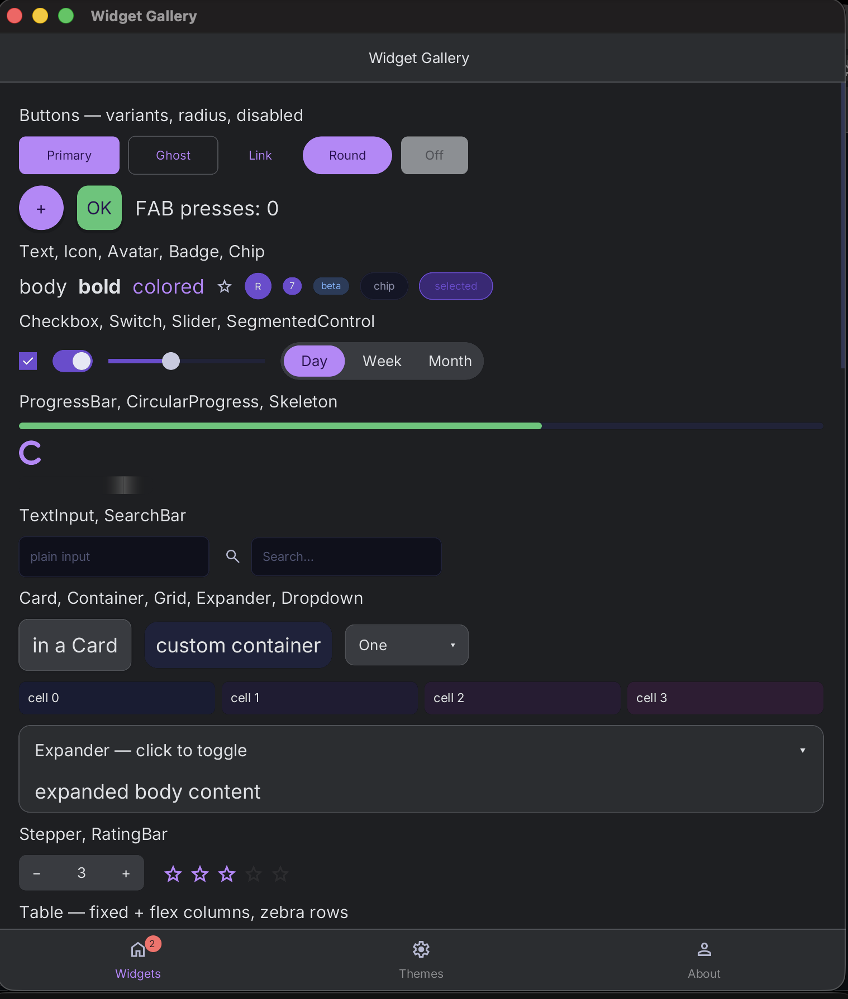
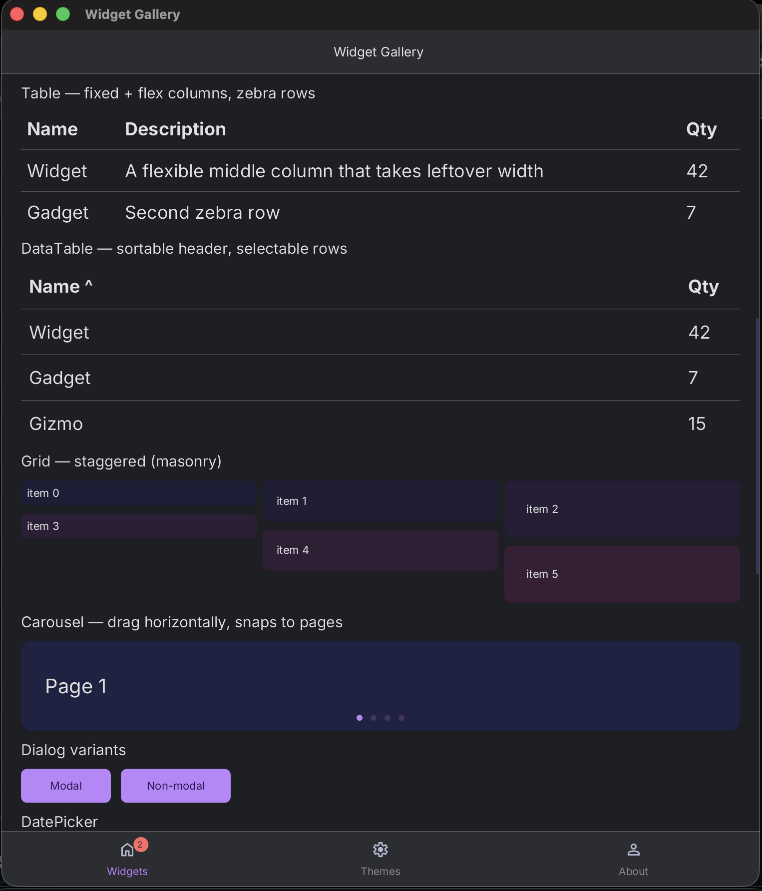
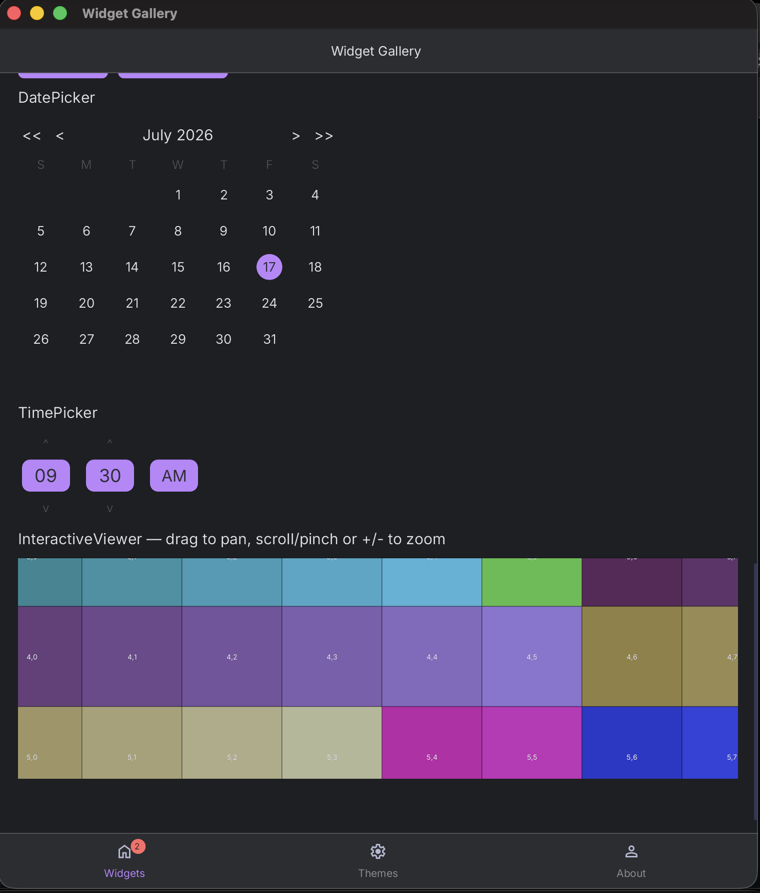

<div align="center">
  

  <p><em>Fast by nature. Beautiful by design.</em></p>

  <p><strong>The UI framework Rust deserved from day one.</strong></p>

  
  -8A2BE2)
  
  
  
  

</div>

---

> **Work in Progress** — Rosace is under active development. APIs are unstable and large parts are still being built. Not production-ready yet — but what's here already runs fast.

---

## ✨ Highlights

One Rust codebase → native-feeling apps on **desktop, web, iOS, and Android**. Everything below is built clean-room, in pure Rust, designed to compose:

| | |
|---|---|
| 🎨 **Declarative GPU shaders** | Shapes, glassmorphism, backdrop blur and custom effects are **SDF shader pipelines on the GPU** — declared like any other widget. No manual draw calls, no `unsafe`. The renderer moved off CPU rasterization to wgpu for **~36× lower CPU per frame**. |
| 🌗 **Dynamic theming** | Material 3 **and** Cupertino out of the box, an exhaustive compile-checked token system, and **runtime theme switching** — change one atom and every subscribed widget repaints. Platform-adaptive by default. |
| 🔥 **Hot reload + in-app DevTools** | A three-tier hot-reload engine (live data-swap → dylib code-swap → hot-restart) picks the fastest path per platform. A built-in **flight recorder** and trace bus record every frame, state change, and event for live debugging. |
| ⚡ **Fine-grained reactivity** | `Atom<T>` state with **subscriber-precise rebuilds** — no virtual-DOM diff, no re-render-the-world. Change state, and only the components that read it repaint. |
| ⌨️ **Real text stack** | `TextInput`/`TextArea` with true keyboard editing, selection, **OS IME** (CJK composition), context menus, and `rosace-forms` validation — not a painted-on illusion. |
| ♿ **Accessible & discoverable** | One semantic tree feeds **platform accessibility** (VoiceOver/TalkBack/ARIA) *and* a **server-side HTML shadow for web SEO** — build it once, get both. |

---

## What is Rosace?

Rosace is a declarative, reactive UI framework built in **pure Rust — from the ground up, without compromise.**

The name comes from *tessera* — the individual tiles of a mosaic. Every component is a tile: self-contained, composable, pixel-precise. Assembled, they form the complete picture of your app.

**The problem it solves.** Building a genuinely native, high-performance UI for every platform today means either shipping a browser (Electron — heavy, slow to start, memory-hungry), maintaining a separate native codebase per OS, or wrestling a Rust ecosystem that's mostly ports and wrappers of ideas from other languages. Rosace's answer: **one Rust codebase, real native windows and native mobile hosts, GPU-native rendering at 120fps, and memory-safety with no garbage collector** — the reach of "write once" without the bloat of a web runtime or the danger of `unsafe`.

Rust's type system isn't a restriction here — it's a design partner. Null-pointer exceptions don't exist. Layout panics don't exist. **If it compiles, it runs.**

---

## Quick look

A complete counter app — a component, reactive state, and a window:

```rust
use rosace::prelude::*;

struct Counter;

impl Component for Counter {
    fn build(&self, ctx: &mut Context) -> Element {
        // `ctx.state` gives you a reactive Atom; reading it subscribes this
        // component, so `set`/`update` repaint exactly this widget — nothing else.
        let count = ctx.state(0i32);

        Scaffold::new(
            Column::new()
                .padding(EdgeInsets::all(24.0))
                .spacing(12.0)
                .child(Text::new(format!("Count: {}", count.get())))
                .child(Button::new("Increment").on_press({
                    let count = count.clone();
                    move || count.update(|n| n + 1)
                })),
        )
        .into_element()
    }
}

fn main() {
    App::new().title("Counter").size(400, 300).launch(Counter);
}
```

That's the whole model: **components read state and describe UI; the framework repaints only what changed.** Everything else — layout, theming, input, platform differences — composes on top.

---

## 📚 Documentation

Full docs live on the **[Rosace Wiki](https://github.com/rosace-ui/rosace/wiki)** — two cross-linked books plus a glossary:

- **[Guide](https://github.com/rosace-ui/rosace/wiki/Guide-Home)** — for app developers. Start here to *build with* Rosace: components, state, layout, theming, navigation, animation, hot reload.
- **[Architecture](https://github.com/rosace-ui/rosace/wiki/Architecture-Home)** — for contributors. How it works *inside*: the frame loop, reactive substrate, render pipeline, widget protocol, platform layer — every claim linked to real source.
- **[Glossary](https://github.com/rosace-ui/rosace/wiki/Glossary)** — every Rosace term plus a from-scratch graphics/GPU primer (UV mapping, SDF, LRU, gamma…), each cross-linked and with authority links to code and Wikipedia.

The editable source lives in [`docs/`](docs/); the wiki is generated from it via [`scripts/docs_to_wiki.py`](scripts/docs_to_wiki.py).

---

## Why Rosace?

Most UI frameworks in the Rust ecosystem are ports, wrappers, or direct translations of ideas from other languages. Rosace is none of those things. It was designed to answer a single question: *what would a UI framework look like if it were built by someone who already knew all the mistakes?*

The answer is a framework that:

- **Never sacrifices performance for convenience** — dirty-region GPU compositing at 120fps by default
- **Never hides cost** — every allocation, draw call, and state update is explicit and traceable
- **Never lies about safety** — lifecycle correctness is enforced at compile time
- **Never forgets developer experience** — the `rsc` CLI, hot reload, and the built-in `RosaceTrace` event bus exist because debugging UI should not be miserable
- **Composes all the way down** — from the layout engine to state atoms to the render layer, every abstraction is composable, not opaque

This isn't a prototype. It's a foundation — and it's being built to last.

---

## Architecture

```
┌─────────────────────────────────────────────────────┐
│                      your app                        │
├─────────────────────────────────────────────────────┤
│   rosace-widgets   │   rosace-cli (rsc)              │  Widgets + CLI
├─────────────────────────────────────────────────────┤
│   rosace-platform  │   rosace-layout                 │  Windowing + Flexure
├─────────────────────────────────────────────────────┤
│   rosace-render    │   rosace-state                  │  Pipeline + Atoms
├─────────────────────────────────────────────────────┤
│   rosace-core      │   rosace-trace                  │  Components + Bus
├─────────────────────────────────────────────────────┤
│              rosace-macros · rosace-compositor        │  Macros + GPU
└─────────────────────────────────────────────────────┘
        wgpu · tiny-skia · fontdue · winit
```

Data flows downward (props). State changes propagate through reactive atoms. The render layer only repaints what changed. The trace bus records everything. See the **[Architecture book](https://github.com/rosace-ui/rosace/wiki/Architecture-Home)** for the full picture.

---

## Getting Started

> Early development — these steps work today but will evolve as the framework stabilises.

**Prerequisites:** Rust 1.78+ (stable), `cargo` in your PATH.

```bash
git clone https://github.com/rosace-ui/rosace.git
cd rosace
cargo build
```

### rsc CLI

```bash
cargo install --path rosace-cli     # install the developer CLI

rsc new my-app                      # scaffold a new Rosace project
rsc dev                             # dev loop with hot reload
rsc run                             # build + run once
rsc run --ios                       # build + run on an iOS simulator
rsc analyze                         # static analysis of your component tree
rsc snapshot --package <pkg> --example <name>   # golden snapshot test
```

### Writing custom widgets

Most app code only composes built-in widgets (`Column`, `Button`, `ScrollView`, …) inside a `Component` — no need to read further. If you're building a genuinely new visual primitive, see [`.steering/WIDGET_AUTHORING_GUIDE.md`](.steering/WIDGET_AUTHORING_GUIDE.md) for the `Widget` trait and the leaf / single-child / multi-child decision table, and the **[Widget Protocol](https://github.com/rosace-ui/rosace/wiki/Architecture-Widget-Protocol)** chapter for how it all fits together.

---

## Gallery

The framework supports a rich set of UI components and effects:

### Glassmorphism & modern effects


### Widget gallery
A showcase of built-in widgets in action:





---

## Crate Overview

| Crate | Description |
|---|---|
| **Core** | |
| `rosace` | Main entry point, app launcher |
| `rosace-macros` | Proc-macros: `#[component]`, `view!{}` |
| `rosace-core` | Component model, element tree, lifecycle hooks |
| **State & Reactivity** | |
| `rosace-state` | `Atom<T>`, `use_atom()`, `GlobalAtom`, batched updates |
| **Layout & Rendering** | |
| `rosace-layout` | Flexure engine: Column, Row, Stack, Flex, Grid, Wrap, SizedBox, AspectRatio |
| `rosace-render` | GPU/CPU hybrid render (wgpu shaders + tiny-skia fallback), dirty regions |
| `rosace-compositor` | GPU layer compositing, sRGB gamma, texture caching |
| `rosace-shader` | Shader registry, SDF pipelines for shapes, glyph atlas |
| `rosace-shaping` | Text shaping (fallback shaper; full HarfBuzz-class shaping deferred) |
| `rosace-bidi` | Bidirectional text layout |
| `rosace-scroll` | Scroll layer, momentum, overscroll |
| **Text & Input** | |
| `rosace-text` | TextInput, TextArea, clipboard, OS IME |
| `rosace-ime` | Native input-method-engine integration |
| `rosace-forms` | Form fields, validation, submission |
| **Widgets** | |
| `rosace-widgets` | 40+ built-in widgets: Button, Card, Dialog, Dropdown, … |
| `rosace-a11y` | Accessibility tree, roles, focus management, semantic HTML |
| **Animation & Interaction** | |
| `rosace-anim` / `rosace-animate` | Animation primitives + high-level API (Tween, Timeline, easing) |
| `rosace-nav-anim` | Route transitions |
| `rosace-gesture` | Touch gestures: scroll, drag, pinch |
| **Navigation** | |
| `rosace-nav` | Navigator, Router, route stack, guards |
| **Styling & Theme** | |
| `rosace-theme` | Platform themes (Material 3, Cupertino), token system |
| `rosace-style` | Style primitives |
| **Platform & FFI** | |
| `rosace-platform` | Windowing (winit), platform events, scroll layers |
| `rosace-ffi` | Native mobile-host FFI bridge (real iOS/Android hosts) |
| **DevTools & Debugging** | |
| `rosace-trace` | Event bus, ring buffer, flight recorder |
| `rosace-devtools` | In-app DevTools |
| `rosace-hot-reload` | File-watching + rebuild primitive for hot reload |
| **Persistence & Networking** | |
| `rosace-storage` | SQLite-backed persistence (`state_permanent`) |
| `rosace-net` / `rosace-ws` | HTTP + WebSocket client, `use_query`, `use_websocket` |
| `rosace-media` | Image/video, camera access |
| **Web & I18n** | |
| `rosace-web-seo` | Semantic HTML shadow tree for web SEO |
| `rosace-i18n` | Internationalization |
| **CLI & Tooling** | |
| `rosace-cli` | `rsc`: new, dev, run, build, package, analyze, snapshot |

---

## Development Phases

**Landed:** reactive state · Flexure layout · GPU-native render (wgpu SDF shapes + glyph atlas) · animation system · 40+ widgets · Material 3 + Cupertino theming · desktop platforms · web (WASM + SEO) · real iOS/Android native hosts · text stack (TextInput/IME/forms) · app lifecycle · three-tier hot reload · event tracing & flight recorder.

**In progress / next:** networking hooks live-verification · persistence tiers (encrypted Keychain/Keystore) · widget expansion (DatePicker, DataTable, rich text/emoji) · declarative shader materials · mobile UI polish · web GPU presenter.

### Multi-platform status
- ✅ Desktop (macOS, Windows, Linux)
- ✅ Web (WASM + semantic SEO tree)
- 🧪 iOS (real native host + Xcode build working; UI polish ongoing)
- 🧪 Android (real native host + Gradle/APK working; UI polish ongoing)

---

## A Note on How This Was Built

> *Coded with AI. Architected by Human.*

Rosace is built with the assistance of AI — and I say that openly, without apology.

Every line was generated with AI assistance, and every single line was read, understood, validated, and approved by me before it landed. The architecture decisions, the crate boundaries, the API shapes, the performance constraints, the trade-offs — those are mine. The AI is a tool. A fast one. But the judgement behind this codebase is human.

This is not a framework vomited out of a prompt. It is designed with intent, built with discipline, and reviewed with care.

---

## Author

<table>
  <tr>
    <td align="center" width="140">
      <a href="https://github.com/godwinjk">
        
      </a>
    </td>
    <td>
      <h3>Godwin Joseph</h3>
      <p>Creator &amp; architect of Rosace. Building the UI framework Rust deserved.</p>
      <p>
        <a href="https://github.com/godwinjk">GitHub</a> ·
        <a href="https://rosace.godwinj.com/">rosace.godwinj.com</a>
      </p>
    </td>
  </tr>
</table>

---

## Contributing

Rosace is not yet open for general contributions while the foundation is being laid. That said:

- **Bug reports** — open an issue with steps to reproduce
- **Feature requests & ideas** — open a discussion issue before building anything
- **Pull requests** — please open an issue first so we can align on scope; keep PRs small and focused

Architectural decisions that govern the project are recorded in [`.steering/DECISIONS.md`](.steering/DECISIONS.md). Read it before opening a PR — decisions marked `LOCKED` are not open for debate unless a new decision supersedes them.

---

## License

Copyright (c) 2026 Godwin Joseph.

This source code is provided for viewing and personal exploration only. You may **not** use, copy, modify, merge, publish, distribute, sublicense, or sell copies of this software, or any derivative works, without explicit written permission from the author.

> **Note:** This license is a placeholder. Rosace will transition to an open-source license (MIT and/or Apache 2.0) prior to its first public release.

---

<div align="center">
  <sub>Built in Rust 🦀 Designed with intent 🦀 Reviewed by hand</sub>
</div>
