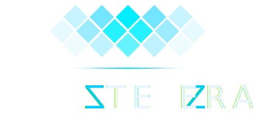

<div align="center">
  

  <br/><br/>

  <p><em>Fast by nature. Beautiful by design.</em></p>

  <br/>

  
  
  
  
</div>

---

> **Work in Progress** — this framework is under active development. APIs are unstable, things will break, and large parts are still being built. Not ready for production use.

---

## What is Tezzera?

Tezzera is a declarative UI framework written in pure Rust. The name comes from *tessera* — the individual tiles that form a mosaic. Every component is a tessera tile: self-contained, composable, and precise. Assembled together they form the full picture of your application.

Write your UI once in Rust. Run it on desktop, web (WASM), iOS, and Android — targeting 120fps by default.

Tezzera draws inspiration from Flutter, Jetpack Compose, SwiftUI, and React, tightened up with Rust's type system: no null pointer surprises, no runtime layout panics, no undefined behaviour.

---

## Architecture

```
┌─────────────────────────────────────────────────────┐
│                  tezzera-examples                   │  Example apps
├─────────────────────────────────────────────────────┤
│   tezzera-widgets   │   tezzera-cli (tzr)           │  Widgets + CLI
├─────────────────────────────────────────────────────┤
│   tezzera-platform  │   tezzera-layout              │  Windowing + Flexure
├─────────────────────────────────────────────────────┤
│   tezzera-render    │   tezzera-state               │  Pipeline + Atoms
├─────────────────────────────────────────────────────┤
│   tezzera-core      │   tezzera-trace               │  Components + Bus
├─────────────────────────────────────────────────────┤
│                  tezzera-macros                     │  Proc-macros
└─────────────────────────────────────────────────────┘
        tiny-skia · fontdue · winit · softbuffer
```

Data flows downward (props); state changes propagate upward through reactive atoms.

---

## Getting Started

> The project is in early development. These steps work today but will evolve as the framework stabilises.

**Prerequisites:** Rust 1.78+ (stable), `cargo` in your PATH.

```bash
# Clone the repo
git clone https://github.com/your-org/tezzera.git
cd tezzera

# Build the workspace
cargo build

# Run the examples
cargo run -p tezzera-examples --bin counter_window
cargo run -p tezzera-examples --bin dashboard
cargo run -p tezzera-examples --bin photo_gallery
cargo run -p tezzera-examples --bin profile_card
```

### tzr CLI

```bash
# Install the developer CLI
cargo install --path tezzera-cli

tzr dev                      # start dev server with hot reload
tzr build --target desktop   # produce a desktop binary
```

---

## Crate Overview

| Crate | Description |
|---|---|
| `tezzera-macros` | Proc-macros: `#[component]`, `view!{}` |
| `tezzera-trace` | `TezzeraTrace` event bus, ring buffer, subscribers |
| `tezzera-core` | Component model, element tree, lifecycle hooks |
| `tezzera-state` | `Atom<T>`, `use_atom()`, `GlobalAtom`, batched updates |
| `tezzera-layout` | Flexure engine: Column, Row, Stack, Flex, Grid, Wrap, SizedBox, AspectRatio |
| `tezzera-render` | tiny-skia render pipeline, dirty regions, layer compositor, `FontCache` |
| `tezzera-widgets` | Built-in widget library |
| `tezzera-platform` | Windowing abstraction (winit + softbuffer) |
| `tezzera-cli` | `tzr` command-line tool |
| `tezzera-examples` | Example applications |

---

## Phase 1 Progress

Goal: a working desktop counter app at 60fps with state, layout, and tracing.

- [x] Reactive state — `Atom<T>`, `use_atom()`, `GlobalAtom`, batched updates
- [x] Layout engine — Column, Row, Stack, Flex, Grid, Wrap, SizedBox, AspectRatio
- [x] Render pipeline — tiny-skia, dirty regions, layer compositor
- [x] Font rendering — fontdue `FontCache` + `draw_text()`
- [x] Lifecycle hooks — `on_mount`, `on_update`, `on_unmount`
- [x] `ErrorBoundary` with panic catching
- [x] `TezzeraTrace` event bus with ring buffer
- [x] `tzr dev` and `tzr build --target desktop`
- [ ] Phase 2 — web/WASM target
- [ ] Phase 3 — mobile (iOS / Android)

---

## Contributing

Tezzera is not yet open for general contributions while the foundation is being laid. That said:

- **Bug reports** — open an issue with steps to reproduce
- **Feature requests & ideas** — open a discussion issue before building anything
- **Pull requests** — please open an issue first so we can align on scope and approach; keep PRs small and focused

Architectural decisions that govern the project are recorded in `.steering/DECISIONS.md`. Read that before opening a PR — decisions marked `LOCKED` are not open for debate unless a new decision supersedes them.

A formal contributor guide will be added before the first public release.

---

## License

Copyright (c) 2026 Godwin Joseph.

This source code is provided for viewing and personal exploration only. You may **not** use, copy, modify, merge, publish, distribute, sublicense, or sell copies of this software, or any derivative works, without explicit written permission from the author.

> **Note:** This license is a placeholder. Tezzera will transition to an open-source license (MIT and/or Apache 2.0) prior to its first public release.

---

<div align="center">
  <sub>Built with Rust. Designed with care.</sub>
</div>
