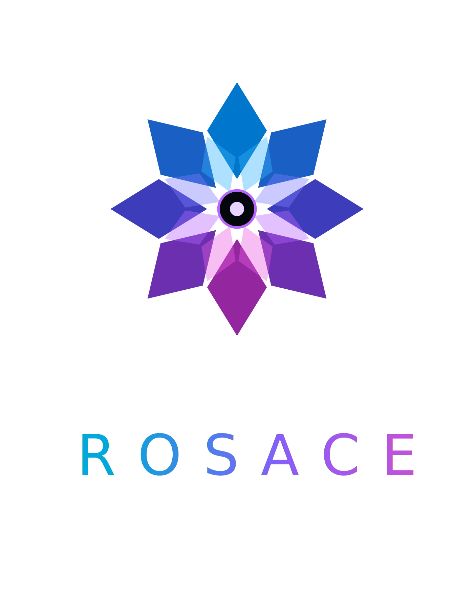

<div align="center">
  

  <p><em>Fast by nature. Beautiful by design.</em></p>

  <p><strong>The UI framework Rust deserved from day one.</strong></p>

  
  
  
  
</div>

---

> **Work in Progress** — Rosace is under active development. APIs are unstable, and large parts are still being built. Not ready for production use — but what's here already runs fast.

---

## What is Rosace?

Rosace is a declarative, reactive UI framework built in pure Rust — from the ground up, without compromise.

The name comes from *tessera* — the individual tiles that form a mosaic. Every component is a tile: self-contained, composable, and pixel-precise. Assembled together they form the complete picture of your application.

Write your UI once in Rust. Target desktop, web (WASM), iOS, and Android — with 120fps as the baseline, not the goal.

Rosace does not patch over existing solutions. It is a clean-room implementation: a purpose-built layout engine, a reactive state model, a software render pipeline — each crate designed to compose perfectly with the others. No hidden overhead. No runtime surprises. No undefined behaviour.

Rust's type system isn't a restriction here — it's a design partner. Null pointer exceptions don't exist in Rosace. Layout panics don't exist. If it compiles, it runs.

---

## Why Rosace?

Most UI frameworks in the Rust ecosystem are ports, wrappers, or direct translations of ideas from other languages. Rosace is none of those things.

It was designed to answer a single question: *what would a UI framework look like if it were built by someone who already knew all the mistakes?*

The answer is a framework that:

- **Never sacrifices performance for convenience** — the render pipeline targets dirty-region compositing at 120fps by default
- **Never hides cost** — every allocation, every draw call, every state update is explicit and traceable
- **Never lies about safety** — `#[component]` guarantees lifecycle correctness at compile time
- **Never forgets developer experience** — the `rsc` CLI, hot reload, and the built-in `RosaceTrace` event bus exist because debugging UI should not be miserable
- **Composes all the way down** — from the layout engine to state atoms to the render layer, every abstraction is composable, not opaque

This isn't a prototype. It's a foundation — and it's being built to last.

---

## Architecture

```
┌─────────────────────────────────────────────────────┐
│                  rosace-examples                   │  Example apps
├─────────────────────────────────────────────────────┤
│   rosace-widgets   │   rosace-cli (rsc)           │  Widgets + CLI
├─────────────────────────────────────────────────────┤
│   rosace-platform  │   rosace-layout              │  Windowing + Flexure
├─────────────────────────────────────────────────────┤
│   rosace-render    │   rosace-state               │  Pipeline + Atoms
├─────────────────────────────────────────────────────┤
│   rosace-core      │   rosace-trace               │  Components + Bus
├─────────────────────────────────────────────────────┤
│                  rosace-macros                     │  Proc-macros
└─────────────────────────────────────────────────────┘
        tiny-skia · fontdue · winit · softbuffer
```

Data flows downward (props). State changes propagate upward through reactive atoms. The render layer only repaints what changed. The trace bus records everything.

A full architecture document is coming. The codebase speaks for itself in the meantime.

---

## Getting Started

> The project is in early development. These steps work today but will evolve as the framework stabilises.

**Prerequisites:** Rust 1.78+ (stable), `cargo` in your PATH.

```bash
# Clone the repo
git clone https://github.com/your-org/rosace.git
cd rosace

# Build the workspace
cargo build
```

### rsc CLI

```bash
# Install the developer CLI
cargo install --path rosace-cli

rsc new my-app              # scaffold a new Rosace project
rsc dev                     # start dev server with hot reload
rsc build --target desktop  # produce a desktop binary
rsc analyze                 # static analysis of your component tree
rsc snapshot                # snapshot test your UI
```

### Writing Custom Widgets

Most app code only ever composes built-in widgets (`Column`, `Button`,
`ScrollView`, ...) inside a `Component` — no need to read further. If you're
building a genuinely new visual primitive, see
[`.steering/WIDGET_AUTHORING_GUIDE.md`](.steering/WIDGET_AUTHORING_GUIDE.md)
for the `Widget` trait, the leaf/single-child/multi-child decision table, and
three worked, compiling examples
(`rosace-examples/src/bin/widget_authoring_demo.rs`).

---

## Crate Overview

| Crate | Description |
|---|---|
| `rosace-macros` | Proc-macros: `#[component]`, `#[state]`, `view!{}` |
| `rosace-trace` | `RosaceTrace` event bus, ring buffer, subscribers |
| `rosace-core` | Component model, element tree, lifecycle hooks |
| `rosace-state` | `Atom<T>`, `use_atom()`, `GlobalAtom`, batched updates |
| `rosace-layout` | Flexure engine: Column, Row, Stack, Flex, Grid, Wrap, SizedBox, AspectRatio |
| `rosace-render` | tiny-skia render pipeline, dirty regions, layer compositor, `FontCache` |
| `rosace-widgets` | Built-in widget library |
| `rosace-platform` | Windowing abstraction (winit + softbuffer) |
| `rosace-cli` | `rsc` command-line tool |
| `rosace-examples` | Example applications |

---

## Phase 1 Progress

Goal: a working desktop app at 60fps with state, layout, render, tracing, animation, accessibility, and a full developer CLI.

- [x] Reactive state — `Atom<T>`, `use_atom()`, `GlobalAtom`, batched updates
- [x] Layout engine — Column, Row, Stack, Flex, Grid, Wrap, SizedBox, AspectRatio
- [x] Render pipeline — tiny-skia, dirty regions, layer compositor
- [x] Font rendering — fontdue `FontCache` + `draw_text()` with correct glyph placement
- [x] Lifecycle hooks — `on_mount`, `on_update`, `on_unmount`
- [x] `ErrorBoundary` with panic catching
- [x] `RosaceTrace` event bus with ring buffer
- [x] Animation — `Tween`, `AnimationController`, `Timeline`, easing curves
- [x] Accessibility — semantic tree, roles, focus management
- [x] Test harness — component-level snapshot and interaction testing
- [x] Proc-macros — `#[component]`, `#[state]`
- [x] `rsc` CLI — `new`, `dev`, `build`, `analyze`, `snapshot`
- [ ] Phase 2 — web/WASM target
- [ ] Phase 3 — mobile (iOS / Android)

---

## A Note on How This Was Built

> *Coded with AI. Architected by Human.*

Rosace is built with the assistance of AI — and I say that openly, without apology.

Every line of code in this framework was generated with AI assistance. And every single line was read, understood, validated, and approved by me before it landed. The architecture decisions, the crate boundaries, the API shapes, the performance constraints, the trade-offs — those are mine. The AI is a tool. A fast one. A capable one. But the judgement behind this codebase is human.

This is not a framework vomited out of a prompt. It is a framework designed with intent, built with discipline, and reviewed with care. The AI accelerated the work. The human made sure it was right.

---

## Contributing

Rosace is not yet open for general contributions while the foundation is being laid. That said:

- **Bug reports** — open an issue with steps to reproduce
- **Feature requests & ideas** — open a discussion issue before building anything
- **Pull requests** — please open an issue first so we can align on scope and approach; keep PRs small and focused

Architectural decisions that govern the project are recorded in `.steering/DECISIONS.md`. Read that before opening a PR — decisions marked `LOCKED` are not open for debate unless a new decision supersedes them.

---

## License

Copyright (c) 2026 Godwin Joseph.

This source code is provided for viewing and personal exploration only. You may **not** use, copy, modify, merge, publish, distribute, sublicense, or sell copies of this software, or any derivative works, without explicit written permission from the author.

> **Note:** This license is a placeholder. Rosace will transition to an open-source license (MIT and/or Apache 2.0) prior to its first public release.

---

<div align="center">
  <sub>Built in Rust. Designed with intent. Reviewed by hand.</sub>
</div>
