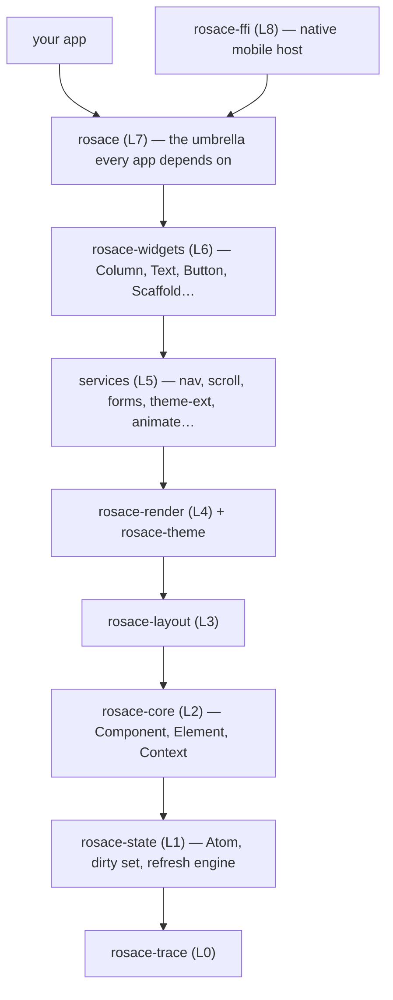
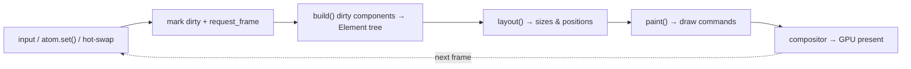

# ROSACE Architecture

> How the framework works on the inside — for contributors and the curious.
> Every claim links to the real code. If a doc and the code disagree, the code wins (and the doc is a bug).

This is the **contributor** book. If you want to *build apps* with ROSACE, read the [Guide](../guide/README.md) instead.

> **New to graphics/GPU terms?** These chapters use standard rendering
> vocabulary — UV mapping, LRU cache, SDF, blend modes, gamma/sRGB, glyph
> atlases. All of it is explained from scratch in the
> [**Glossary's graphics primer**](../GLOSSARY.md#graphics-gpu--rendering--a-plain-language-primer),
> and the prose links to each term the first time it appears. You never have
> to already know a term to read on.

---

## What ROSACE is, in one paragraph

ROSACE is a declarative, retained-mode UI framework in Rust. You describe your UI as a tree of **components** that read **reactive state**; the framework rebuilds the parts that changed, lays them out, paints them to a GPU surface, and does this on every platform — desktop, web, iOS, Android — from one codebase. The design goal (from [PRINCIPLES.md](../PRINCIPLES.md)): *strict underneath, invisible on top* — a lot of machinery so app code stays tiny.

## The layer cake

Crates are strictly layered: a crate may only depend on **lower** layers. App code depends on exactly one crate — `rosace` (Layer 7). The full contract is in [CRATE_CONTRACTS.md](../CRATE_CONTRACTS.md); the short version:

The one rule that keeps it honest: **dependencies only point down.** `rosace-core` can never call `rosace-widgets`. This is why the framework is testable in pieces and why a bug in the render layer can't reach into state.

## The frame pipeline

Everything the framework *does* at runtime is one loop. A state change (or an input event, or a hot-reload swap) marks components dirty and requests a frame; the next frame rebuilds only what's dirty, then lays out and paints:

The heart of this loop is [`FrameEngine::paint`](../../rosace/src/engine.rs) — read [core.md](core.md) for how it decides what to rebuild.

## How to read these docs

Each subsystem doc follows one shape (see [`_template.md`](_template.md)):

1. **In one sentence** — the layman version.
2. **Mental model** — an analogy or diagram.
3. **How it works** — the flow, with links to `crate/src/file.rs`.
4. **Key types** — the handful of names that matter.
5. **Why it's like this** — links to the relevant decisions in [DECISIONS.md](../DECISIONS.md).
6. **Gotchas & invariants** — the things that bite.

## Table of contents

Start with the **core** and expand outward — see [SUMMARY.md](SUMMARY.md).

1. [Core: Component, Element, Context](core.md) ← start here
2. [State & reactivity](state-and-reactivity.md)
3. [Render pipeline](render-pipeline.md)
4. [Widget Protocol](widget-protocol.md)
5. [Platform & the App Loop](platform-and-app-loop.md)
6. [The `rsc` CLI](cli.md)
7. [Hot Reload](hot-reload.md) *(distilled from [HOT_RELOAD.md](../../.steering/HOT_RELOAD.md))*
