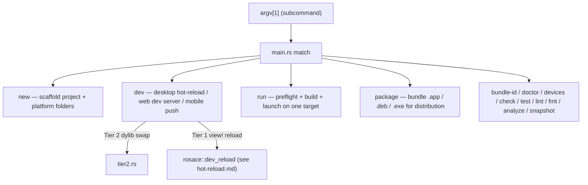

# The `rsc` CLI

> Covers `rosace-cli` — the `rsc` binary: command dispatch, `rsc new`'s scaffolder, `rsc dev`'s hot-reload orchestration, `rsc run`'s per-platform build+launch, and `rsc package`'s distribution bundling.

## In one sentence

`rsc` is a single binary with no argument-parsing dependency — a hand-rolled `match` on `argv[1]` dispatches to one module per subcommand, and each subcommand hides a platform's real toolchain (cargo, wasm-bindgen, xcodebuild, gradlew, codesign) behind one command so app authors never touch them directly.

## Mental model

Think of `rsc` as a thin, honest wrapper: it does not reimplement build systems, it *drives* them. `rsc new` writes real, editable project files (a Cargo workspace, a real Xcode project, a real Gradle project) instead of hiding them in a generated cache — so `rsc build`/`rsc run` are just "call the right underlying tool with the right flags for this platform," and a developer can always drop into Xcode or Android Studio directly if they need to.

## How it works

**1. `main.rs` is a flat dispatcher — there is no clap/structopt.** [`rosace-cli/src/main.rs`](../../rosace-cli/src/main.rs) reads `args[1]` as the subcommand and matches it directly to a module in [`commands/`](../../rosace-cli/src/commands/mod.rs) (`new`, `run`, `build`, `package`, `dev`, `bundle_id`, `doctor`, `devices`, `check`/`test`/`lint`/`fmt` via `workspace`, `analyze`, `snapshot`). Every subcommand module owns its own `Options::from_args(&[String])` parser (hand-rolled `--flag value` / `--flag=value` matching) and a `run(opts) -> Result<(), String>` entry point — errors print in red via [`color.rs`](../../rosace-cli/src/color.rs) and exit non-zero. `color.rs` itself respects `NO_COLOR` and auto-disables when stdout isn't a TTY, so piped/CI output never carries raw escape codes.

**2. `rsc new` scaffolds a real, multi-file, multi-platform project.** [`commands/new.rs`](../../rosace-cli/src/commands/new.rs) (the largest command module by far) writes a standard project shape — `src/main.rs`, `src/lib.rs`, `src/app.rs`, `src/theme.rs`, `src/screens/` — plus per-platform folders selected via `--platforms` or an interactive prompt: `web/index.html` + a build-time SEO extractor for Web, a full `.xcodeproj` + Swift `AppDelegate`/`SceneDelegate`/`EngineViewController` for iOS, a full Gradle project + Kotlin `MainActivity` + JNI glue for Android, and platform manifests (`Info.plist`, Windows app manifest, a `.desktop` entry) for the desktop OSes. iOS and Android additionally get `src/ffi.rs` — the D106 native-host FFI glue shared by both mobile platforms. `Platform` (the enum `new.rs` scaffolds for) deliberately has no "Desktop" bucket: macOS/Windows/Linux each need their own icon format and config file, so lumping them together would generate files for OSes the user never asked for.

**3. `rsc run` is preflight, then dispatch by target.** [`commands/run.rs`](../../rosace-cli/src/commands/run.rs) resolves a `Target` (`--target`/`--mac`/`--win`/`--lnx`, defaulting to the host OS — the one platform `rsc run` can both build *and* execute locally), runs a target-specific [`preflight`](../../rosace-cli/src/commands/run.rs) check (does `codesign` exist for macOS? is the cross-compilation target installed for Windows/Linux? does `xcodebuild -version` actually run, not just `xcode-select -p`? does `android/gradlew` exist?) that fails fast with an actionable install command instead of a raw tool error, then calls the matching `run_*` function — `run_macos`, `run_windows_cross_build`, `run_linux_cross_build`, `run_web` (wasm-bindgen + serve), `run_ios` (real `.xcodeproj` via `xcodebuild` + `simctl`, or a legacy hand-rolled harness if no Xcode project exists), `run_android` (Gradle + `adb`).

**4. `rsc dev` and `rsc run` are different jobs: dev optimizes iteration speed, run optimizes "does the real build work."** `rsc run` always does a fresh build for the target platform and launches it once. `rsc dev` ([`commands/dev.rs`](../../rosace-cli/src/commands/dev.rs)) is the fast inner loop, and its default behavior differs sharply by target:
   - **Desktop, no flags** — Tier 2 dylib hot-reload (D102): [`commands/tier2.rs`](../../rosace-cli/src/commands/tier2.rs) builds the app as a reloadable `dylib`, builds a tiny host binary that links the same shared `rosace` dylib, launches the host, and watches `src/` — every edit rebuilds *only* the module dylib and the host hot-swaps it live, no restart, any code (not just data) reloads. If the app doesn't export the Tier-2 entry point (`__rsc_dev_root` — see [hot-reload.md](hot-reload.md)), `dev` prints a message and falls back to Tier 1.
   - **Desktop, `--watch`** — a supervised Tier-0 hot-*restart* loop (`run_desktop_watch`): `rsc` owns the app as a child process, rebuilds via [`rosace-hot-reload::RebuildRunner`](../../rosace-hot-reload/src/rebuild.rs) on every file-watcher event, and relaunches the child on a successful build (a failed build leaves the running app untouched). Persistent (`state_permanent`) atoms survive because they're on disk; everything else resets.
   - **Desktop, neither flag but no Tier-2 export** — plain Tier 1: `cargo run --features rosace/rsc-hot`, so `view!` sites register descriptors and the in-process watcher ([`rosace::dev_reload`](../../rosace/src/dev_reload.rs)) can swap them live without any dylib machinery.
   - **`--target web`** — builds wasm with `rosace/rsc-hot`, serves `dist/` over a hand-rolled HTTP server, and (unlike `rsc run --target web`) also opens a WebSocket at `/__rosace_hot` that pushes edited source text to the browser on every save (`serve_dist_hot`, distinct from the plain `serve_dist` that `run` uses).
   - **`--target android`/`--target ios`** — the app is already running on the device (deployed separately via `rsc run --android`/`--ios`); `dev` just watches `src/` and pushes edited source over a length-framed TCP socket (`adb forward`ed for Android; the iOS simulator shares the host's localhost) to the socket `rosace-ffi` opens on-device.

**5. `rsc package` bundles a release build for distribution, not for running.** [`commands/package.rs`](../../rosace-cli/src/commands/package.rs) reads app name/version from `Cargo.toml`/`rsc.toml` and produces a real distributable artifact per host platform: a `.app` bundle (code-signed, ad-hoc by default unless `--identity` names a real signing identity) on macOS, a `.deb`-shaped tree on Linux, a portable `.exe` + DLLs folder on Windows.

**6. Everything downstream of `rsc dev`/`rsc run` is the same file-watching primitive.** [`rosace-hot-reload`](../../rosace-hot-reload/src/lib.rs) is a small, dependency-free crate: [`FileWatcher`](../../rosace-hot-reload/src/watcher.rs) polls watched directories every 200ms for `.rs`/asset-extension mtime changes (through a [`Debouncer`](../../rosace-hot-reload/src/debounce.rs) that collapses a rapid burst into one event), and [`RebuildRunner`](../../rosace-hot-reload/src/rebuild.rs) is a thin `cargo build` wrapper. `dev.rs` and `tier2.rs` both build on this same watcher for their respective transports — the watcher itself has no opinion about desktop/web/mobile or Tier 1/2.

## Key types

- [`commands::{new, dev, run, package, bundle_id, doctor, devices, workspace, tier2}`](../../rosace-cli/src/commands/mod.rs) — one module per subcommand; each owns an `Options` parser + a `run` entry point.
- [`new::Platform`](../../rosace-cli/src/commands/new.rs) — the six explicit scaffold targets (`MacOs`/`Windows`/`Linux`/`Web`/`Ios`/`Android`), deliberately no combined "Desktop."
- [`run::Target`](../../rosace-cli/src/commands/run.rs) — the six `rsc run` targets and their `preflight`/`run_*` dispatch.
- [`dev::DevTarget`](../../rosace-cli/src/commands/dev.rs) — `Desktop`/`Web`/`Android`/`Ios`, each with its own hot-reload transport.
- [`tier2::run`](../../rosace-cli/src/commands/tier2.rs) — the Tier-2 dylib build/host/watch orchestration invoked by `rsc dev` on desktop.
- [`rosace_hot_reload::{FileWatcher, Debouncer, RebuildRunner}`](../../rosace-hot-reload/src/lib.rs) — the shared polling-watcher + rebuild primitive every `dev` transport is built on.
- [`color`](../../rosace-cli/src/color.rs) — `NO_COLOR`-respecting, TTY-detecting ANSI helpers used for every subcommand's error/status output.

## Why it's like this

- **D052 — the CLI is named `rsc`.** Locked early; see [D052 in DECISIONS.md](../DECISIONS.md).
- **D120 — the FFI/CLI-adjacent C ABI dropped the `tzr` prefix for `rsc`.** Every generated Swift/Kotlin template, FFI symbol, and internal helper `rsc new` scaffolds now consistently says `rsc`/`Rsc`/`RSC_*` — the earlier `tzr`-era naming was legacy, not a decision, and was renamed while pre-1.0 made it cheap (every consumer is an `rsc new`-generated template, easy to regenerate). See [D120 in DECISIONS.md](../DECISIONS.md).
- **D106 — mobile needs a real native host project; winit cannot own the iOS app.** This is why `rsc new --platforms ios/android` writes a real `.xcodeproj`/Gradle project instead of hiding native config behind a generator, and why `rsc run --target ios/android` shells out to `xcodebuild`/`gradlew` rather than reimplementing them. See [D106 in DECISIONS.md](../DECISIONS.md).
- **Explicit macOS/Windows/Linux targets, not one "desktop" bucket.** Each has distinct toolchain requirements (codesign, a specific Rust cross-target + linker, gradle-style packaging) that `preflight` needs to check independently — collapsing them would either over-check or under-check depending on the host OS.
- **`rsc dev`'s default behavior escalates from the fastest available reload tier.** Tier 2 (dylib swap) is tried first because it reloads everything with no restart; the fallback chain (Tier 2 → Tier 1 → Tier 0 restart) exists because not every project is Tier-2-ready and not every platform even supports it (see [hot-reload.md](hot-reload.md) for the full tier breakdown, D102).

## Gotchas & invariants

- **`rsc dev` (desktop, default) silently falls back, it doesn't error, when the app isn't Tier-2-ready.** If your `lib.rs` has no `__rsc_dev_root` export, you get a one-line notice and Tier 1 (`cargo run --features rosace/rsc-hot`) instead of a hard failure — don't be surprised that "hot reload isn't swapping my `build()` changes live" if the app predates or skipped that export.
- **`rsc dev --target web` and `rsc run --target web` serve `dist/` differently.** Only `dev` opens the `/__rosace_hot` WebSocket and pushes edits; `run`'s `serve_dist` is the plain, no-hot-reload server. Don't expect live-reload behavior from `rsc run --target web`.
- **Cross-compiling Windows/Linux from macOS only produces a binary — `rsc run` can't execute it.** `preflight_cross_target` checks the Rust target and a cross-linker (mingw-w64 for Windows) are installed, but running the resulting binary on a foreign OS is out of scope; `rsc run --win`/`--lnx` on macOS builds, it does not launch.
- **`rsc new`'s `Platform` enum and `new.rs`'s scaffolding are large and stringly keyed in places** (bundle IDs, JNI class name mangling, `.pbxproj` string templates) — when adding a platform-specific file, follow the existing `has(Platform::X)` gating pattern rather than introducing a new conditional shape.
- **The Tier-2 host and module dylib must share identical `RUSTFLAGS` and `CARGO_TARGET_DIR`**, or cargo re-fingerprints and rebuilds everything on every edit — `tier2.rs`'s `hot_env` helper is the one place this constant is defined; don't set these flags ad hoc elsewhere in the dev path.
