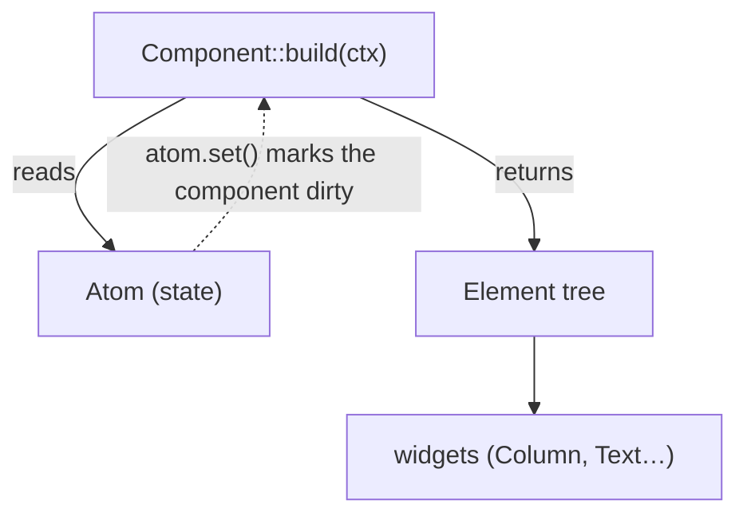

# Core: Component, Element, Context

> Covers `rosace-core` (Layer 2) and its role in the frame loop. This is the spine everything else hangs off — read it first.

## In one sentence

You write **Components** that produce an **Element** tree by reading state through a **Context**; the framework turns that tree into on-screen widgets and rebuilds only the components whose state changed.

## Mental model

If you know React: `Component` ≈ a component, `build()` ≈ `render()`, `Context::state` ≈ `useState`, and an **Atom** ≈ a piece of reactive state. The key difference from React: there is no virtual-DOM diff of *everything* every frame. ROSACE tracks which components read which atoms, and when an atom changes it rebuilds **only its subscribers**.



## How it works

**1. You implement `Component`.** One method, called by the framework:

```rust
pub trait Component: Send + Sync + 'static {
    fn build(&self, ctx: &mut Context) -> Element;
}
```
[`rosace-core/src/component.rs`](../../rosace-core/src/component.rs)

**2. `build()` reads state via `Context`.** `ctx.state(default)` returns an [`Atom<T>`](../../rosace-state/src/atom.rs) — a reactive cell. State is keyed by **call order** (a hooks model, like React's `useState`), so call `ctx.state(...)` unconditionally and in a stable order:

```rust
pub fn state<T: Clone + Send + Sync + 'static>(&mut self, default: T) -> Atom<T>
```
[`rosace-core/src/context.rs`](../../rosace-core/src/context.rs). There is also `ctx.state_permanent(key, default)` (survives restarts — see [D114/D121](../DECISIONS.md)), which is key-based because it persists to disk.

**3. `build()` returns an `Element`.** [`Element`](../../rosace-core/src/element.rs) is the lightweight description of the tree — either a nested component or a *native* node carrying a boxed widget. You rarely construct `Element` directly: widgets provide `.into_element()`, and returning a widget from a `Scaffold`/layout does it for you.

**4. The frame engine turns Elements into pixels — but only when dirty.** The loop lives in [`FrameEngine::paint`](../../rosace/src/engine.rs). Each frame it:
   - drains the **dirty set** (`rosace_state::take_dirty_components()` + `is_global_dirty()`);
   - **rebuilds only dirty components** (clean ones reuse their cached Element — this is why `build()` must not have side effects that need to run every frame);
   - lays out the tree ([`rosace-layout`](../../rosace-layout/src/)), then paints it ([`rosace-render`](../../rosace-render/src/)), then the compositor presents it to the GPU surface.

**5. A state change re-enters the loop.** `atom.set(v)` marks every subscribed component dirty and calls `request_frame()`, which wakes the platform loop to render one frame. See [state-and-reactivity.md](state-and-reactivity.md) for the dirty-set details.

## Key types

- [`Component`](../../rosace-core/src/component.rs) — what you implement; `build(&self, &mut Context) -> Element`.
- [`Context`](../../rosace-core/src/context.rs) — the per-build handle: `state`, `state_permanent`, and the hooks bookkeeping.
- [`Element`](../../rosace-core/src/element.rs) — the tree description (component vs native-widget node).
- [`Atom<T>`](../../rosace-state/src/atom.rs) — a reactive value: `get()`, `set()`, `update()`.
- [`FrameEngine`](../../rosace/src/engine.rs) — drives build → layout → paint each frame; the one place that decides what to rebuild.

## Why it's like this

- **Hooks-style `ctx.state` (call-order keyed), not fields.** Chosen so components stay plain structs and state co-locates with the code that uses it — see the state decisions in [DECISIONS.md](../DECISIONS.md) (D008/D121 for persistence tiers).
- **Rebuild only the dirty subtree, never the whole tree.** The whole point of the atom→subscriber tracking: 60fps means you cannot afford to re-run every `build()` every frame. This is why `build()` is expected to be cheap and side-effect-light.
- **`Element` is deliberately thin.** It's a *description*, not a widget; the actual widget objects (`Column`, `Text`) live one layer up in `rosace-widgets`. Keeping the tree description in `rosace-core` is what lets layout/reconciliation reason about structure without depending on the widget set.

## Gotchas & invariants

- **Call `ctx.state(...)` in a stable order, unconditionally.** State is matched by call order within a `build()`. Putting `ctx.state` behind an `if` shifts every later slot and corrupts state identity (the classic hooks rule).
- **`build()` runs only when the component is dirty.** Don't rely on it running every frame. If you `atom.set()` *inside* `build()` you can create a rebuild loop — state changes belong in event handlers, not in `build()`.
- **Clean frames reuse the cached Element.** A component that isn't dirty is not rebuilt; its previously-returned Element is reused. If nothing you can see changed but you expected an update, check that the atom you changed is actually the one the component read.
