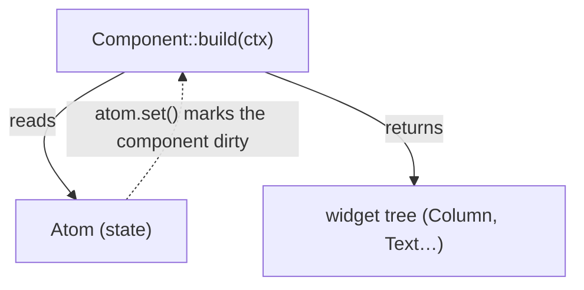

# Core: Component, Widget, Context

> Covers `rosace-core` (Layer 2) and its role in the frame loop. This is the spine everything else hangs off — read it first.

## In one sentence

You write **[Components](../GLOSSARY.md#component)** that produce a **widget** tree by reading state through a **[Context](../GLOSSARY.md#context)**; the framework lays that tree out, paints it, and rebuilds only when the state it read changed.

## Mental model

If you know React: `Component` ≈ a component, `build()` ≈ `render()`, `Context::state` ≈ `useState`, and an **[Atom](../GLOSSARY.md#atom)** ≈ a piece of reactive state. The key difference from React: there is no virtual-DOM diff of *everything* every frame. ROSACE tracks which components read which atoms, and when an atom changes it rebuilds **only its subscribers** (the [RefreshEngine](../GLOSSARY.md#refreshengine)).


```mermaid
graph TD
    C["Component::build(ctx)"] -->|reads| A["Atom (state)"]
    C -->|returns| WID["widget tree (Column, Text…)"]
    A -.->|"atom.set() marks the component dirty"| C
```

## How it works

**1. You implement `Component`.** One method, called by the framework:

```rust
pub trait Component: Send + Sync + 'static {
    fn build(&self, ctx: &mut Context) -> BoxedWidget;
}
```
[`rosace-widgets/src/component.rs`](../../rosace-widgets/src/component.rs)

**2. `build()` reads state via `Context`.** `ctx.state(default)` returns an [`Atom<T>`](../../rosace-state/src/atom.rs) — a reactive cell. State is keyed by **call order** (a hooks model, like React's `useState`), so call `ctx.state(...)` unconditionally and in a stable order:

```rust
pub fn state<T: Clone + Send + Sync + 'static>(&mut self, default: T) -> Atom<T>
```
[`rosace-core/src/context.rs`](../../rosace-core/src/context.rs). There is also `ctx.state_permanent(key, default)` (survives restarts — see [D114/D121](../DECISIONS.md)), which is key-based because it persists to disk.

**3. `build()` returns a widget.** `BoxedWidget` is `Arc<dyn Widget>` — the widget you composed, type-erased. `.boxed()` at the end of `build()` is the whole ceremony; there is no separate description tree in between.

**4. The frame engine turns widgets into pixels — but only when dirty.** The loop lives in [`FrameEngine::paint`](../../rosace/src/engine.rs). Each frame it:
   - drains the **[dirty](../GLOSSARY.md#dirty) set** (`rosace_state::take_dirty_components()` + `is_global_dirty()`);
   - **rebuilds only when dirty** (a clean frame reuses the last built widget — this is why `build()` must not have side effects that need to run every frame);
   - lays out the tree ([`rosace-layout`](../../rosace-layout/src/)), then paints it ([`rosace-render`](../../rosace-render/src/)), then the compositor presents it to the GPU surface.

**5. A state change re-enters the loop.** `atom.set(v)` marks every subscribed component dirty and calls `request_frame()`, which wakes the platform loop to render one frame. See [state-and-reactivity.md](state-and-reactivity.md) for the dirty-set details.

## Key types

- [`Component`](../../rosace-widgets/src/component.rs) — what you implement; `build(&self, &mut Context) -> BoxedWidget`.
- [`Context`](../../rosace-core/src/context.rs) — the per-build handle: `state`, `state_permanent`, and the hooks bookkeeping.
- [`Widget`](../../rosace-widgets/src/tree/mod.rs) — what actually measures and paints; see [widget-protocol.md](widget-protocol.md).
- [`Atom<T>`](../../rosace-state/src/atom.rs) — a reactive value: `get()`, `set()`, `update()`.
- [`FrameEngine`](../../rosace/src/engine.rs) — drives build → layout → paint each frame; the one place that decides what to rebuild.

## Why it's like this

- **Hooks-style `ctx.state` (call-order keyed), not fields.** Chosen so components stay plain structs and state co-locates with the code that uses it — see the state decisions in [DECISIONS.md](../DECISIONS.md) (D008/D121 for persistence tiers).
- **Rebuild only the dirty subtree, never the whole tree.** The whole point of the atom→subscriber tracking: 60fps means you cannot afford to re-run every `build()` every frame. This is why `build()` is expected to be cheap and side-effect-light.
- **There is no `Element` layer.** `build()` returns the widget itself. An earlier design put a thin `Element` description in `rosace-core` between the two; it never carried information the widget tree did not already have — the persistent structure is the [`RenderTree`](../../rosace-widgets/src/tree/render_tree.rs) arena, and that is where identity, layout caches, paint caches and per-node state live.
- **Why `build()` can't just return "whatever widget you built", and why you have to call `.boxed()` yourself.** This trips people up, so in detail:

  Every `Component` the framework holds onto is stored behind a `dyn` pointer — the framework doesn't know or care which concrete struct it's talking to, just that it's *some* `Component`. Rust builds that with a **vtable**: a small fixed table of function-pointer slots, the same shape for every implementor, so the framework can call `build()` on any of them the same way without knowing which one it is. Think of it like a light switch on the wall — flipping it works the same regardless of which bulb is wired up behind it, but that only works because every bulb has the *same* two-prong socket. A vtable slot needs that same fixed shape: one function pointer, one fixed return type.

  A generic return type (`fn build<W: Widget>(&self, ctx) -> W`) or an opaque one (`fn build(&self, ctx) -> impl Widget`) breaks that: `W` is a *different concrete type for every implementor* — `Counter` might build a `Column`, `Greeting` might build a `Text`. Different sizes, different layouts. There's no single "the return type" to put in the shared vtable slot. So the compiler simply refuses it — this isn't a ROSACE design choice, it's Rust telling you a `dyn`-called method can't have a per-caller return type.

  So `build()`'s return type is pinned to one fixed, concrete type: `BoxedWidget`, i.e. `Arc<dyn Widget>`. `.boxed()` is what erases your concrete widget into it. Rust never inserts a conversion like that for you automatically at a `return` — someone has to call it, so `Component` implementations do, once, at the end of `build()`.
- **`Component` lives in `rosace-widgets`, not `rosace-core`.** `build` names `Widget`, and `Widget` is defined there. Moving `Widget` down into `rosace-core` instead would have dragged `rosace-render`, `rosace-theme` and `rosace-layout` with it and inverted the workspace's layering; `Context` stays in `rosace-core`, which only needs `ComponentId`.

## Gotchas & invariants

- **Call `ctx.state(...)` in a stable order, unconditionally.** State is matched by call order within a `build()`. Putting `ctx.state` behind an `if` shifts every later slot and corrupts state identity (the classic hooks rule).
- **`build()` runs only when the component is dirty.** Don't rely on it running every frame. If you `atom.set()` *inside* `build()` you can create a rebuild loop — state changes belong in event handlers, not in `build()`.
- **Clean frames reuse the last built widget.** A component that isn't dirty is not rebuilt; its previously-returned widget is painted again (usually from its cached picture). If nothing you can see changed but you expected an update, check that the atom you changed is actually the one the component read.
