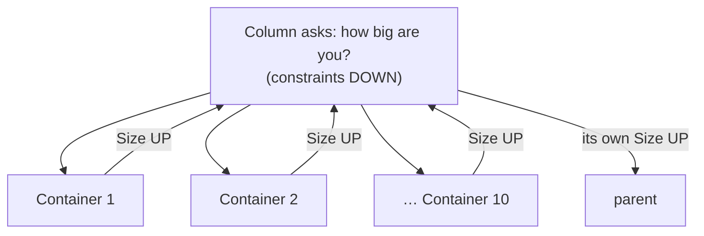

# Layout & Invalidation

> How a widget gets a size, how a size reaches its parent, and how the engine
> decides what to redo. Covers `rosace-widgets` (`tree/mod.rs`,
> `tree/render_tree.rs`) and the walk in `rosace/src/lib.rs`.

> **Status (2026-08-18):** per-node layout caching lives on branch
> `engine/layout-cache` and is not on `main`. Everything below describes that
> branch. One open defect is documented under [Gotchas](#gotchas--invariants) —
> read it before relying on the caching behaviour.

## In one sentence

Every frame the engine asks each widget "how big are you?" and then "draw
yourself here" — and it keeps a numbered slot per widget so that next frame it
can skip asking again when nothing that could change the answer has changed.

## Mental model

Two people walk the same corridor of numbered lockers, in order.

The **measurer** goes first. At each locker they ask the widget its size and
write the answer on a card inside. The **painter** follows, reads what's needed,
and puts the drawing in the same locker.

Because both walk in the same order, locker #3 means the same widget to both.
Next frame, if nothing about a widget changed, the measurer reads the card
instead of asking again, and the painter reuses the drawing instead of redrawing.

Two rules make the whole thing work, and both are worth memorising:

- **Constraints travel DOWN. Sizes travel UP.** A parent tells a child how much
  room it may use; the child replies with how much it took.
- **Sizes are decided in layout. Positions are decided in paint.** This differs
  from Flutter, where layout also assigns offsets.



## How it works

### One frame, end to end

1. **Build.** If a component is dirty, `build()` re-runs and produces a fresh
   widget tree. If not, last frame's tree is reused.
2. **Classify** the frame — [`engine.rs:978`](../../rosace/src/engine.rs).
   *Structural* means something rebuilt, so every widget object is new and no
   cache can be trusted. *Targeted* means nothing rebuilt and only explicitly
   marked nodes changed.
3. **Layout walk** — sizes only.
4. **Paint walk** — positions children and records draw commands.
5. **Damage & present** — only changed pixels are re-rasterised.

### The layout walk

Entry is [`rosace/src/lib.rs:448`](../../rosace/src/lib.rs), which calls
`layout` on the root widget with the window's constraints. From there it is
pure recursion: a container measures its children, sums the results, and
returns its own size.

A container measures a child through one of these, and **which one it picks is
the whole safety story**:

| method | gives the child its own slot? | reads the cache? | for |
|---|---|---|---|
| [`layout_child_at(i, ..)`](../../rosace-widgets/src/tree/mod.rs) | yes, by **index** | yes | containers that measure exactly the children they paint, in order — `Row`, `Column`, `Grid`, `Wrap`, `Stack` |
| [`layout_child(..)`](../../rosace-widgets/src/tree/mod.rs) | yes, by **call order** | yes | single-child wrappers whose child is paint slot 0 — `Card`, `Container`, `Sheet`, `Dialog`, `Positioned` |
| [`layout_child_uncached(..)`](../../rosace-widgets/src/tree/mod.rs) | yes | **no** | a child that was freshly **built** this frame — `Stateful`, `HeroTag` |
| [`detached()`](../../rosace-widgets/src/tree/mod.rs) | **no slot at all** | no | a widget that measures a tree it may not paint — `Responsive` |
| [`measure_child(..)`](../../rosace-widgets/src/tree/mod.rs) | peeks the slot `paint_child` will consume | yes | measuring during **paint**, to compute a child's rect |

The cache check itself is small — same constraints, not marked, and a stored
size:

```rust
if use_cache
    && !is_structural_frame()
    && n.last_constraints == Some(constraints)
    && !n.needs_layout
{
    if let Some(size) = n.cached_size { return size; }
}
```

This is Flutter's `if (!_needsLayout && constraints == _constraints) return;`.
Flutter pairs it with a list of relayout-boundary roots so the walk need not
start at the top; we deliberately don't, because reaching a boundary directly
requires a node to reach its own layout logic, and `TreeNode` is a side-table
that does not hold the widget. With the early return, the top-down walk returns
immediately at every clean node anyway.

### The paint walk

[`paint_child(rect, child)`](../../rosace-widgets/src/tree/mod.rs) takes the
next slot, and either replays the stored picture or re-records it. It replays
only when **all** of these hold: the slot's widget type is unchanged, the frame
is targeted, the node isn't marked `needs_paint`, a picture exists, the rect is
identical, and the widget isn't self-animating.

The rect check is why scrolling still works: as content moves, every child's
rect changes, so every child re-records rather than replaying at a stale
position.

## Worked example — a `Column` with 10 `Container`s

Ten containers of different heights (20, 35, 50, … px) in a `Column`, inside a
600px-tall window.

### Frame 1 — first paint

**Layout.** `Column::layout` runs
[`measure`](../../rosace-widgets/src/tree/column.rs), which loops the children:

```rust
for (i, child) in self.children.iter().enumerate() {
    let s = ctx.layout_child_at(i, Constraints::loose(max_w, max_h), &**child);
    fixed_h += s.height;
}
```

`layout_child_at(i, ..)` addresses `children[i]` **by index**, not by call
order — because `Column` measures in two passes (non-flex children first, flex
second), so call order is not slot order. Each child is new, so each is
measured, and each stores `cached_size` and `last_constraints` on its node.

Column sums: `20 + 35 + 50 + … + 9×spacing` → say **480px**. That 480 is
returned **up** to Column's parent, which stores it as *its* child's size.

**Paint.** `Column::paint` re-reads the sizes (from its per-frame `measure_cache`,
so nothing is measured twice), computes each child's rect via `layout_column`,
and calls `paint_child(child_rect, child)` for each in order — slots 0..9, the
same slots the index-addressed layout used.

**Cost:** 10 measures, 10 paints.

### Frame 2 — nothing happens

No component is dirty, no node is marked. The engine skips the frame entirely.
**Cost: 0.**

### Frame 3 — hover container #4

The dispatcher calls
[`set_hover`](../../rosace-widgets/src/tree/render_tree.rs), which sets
`needs_paint` on node #4 and clears it on the previously hovered node. It does
**not** set `needs_layout` — and that is a structural guarantee, not a
convention: `LayoutCtx` exposes no way to read `hovered`/`pressed`, so a size
provably cannot depend on them.

- **Layout:** every node has matching constraints and `needs_layout == false`
  → all 10 return `cached_size`. **0 re-measures.**
- **Paint:** node #4 has `needs_paint` → re-records. The other 9 have unchanged
  rects and no mark → **replay their stored pictures.**

**Cost: 0 measures, 1 paint, 9 memcpys.** Asserted by
[`layout_scope.rs`](../../rosace/tests/layout_scope.rs) and
[`repaint_scope.rs`](../../rosace/tests/repaint_scope.rs).

### Frame 4 — container #4 grows from 50px to 120px

Something calls `refresh_state()`, which routes to
[`mark_dirty_with_ancestors`](../../rosace-widgets/src/tree/render_tree.rs):

```rust
self.nodes[node].needs_layout = true;
self.nodes[node].needs_paint  = true;
let mut cur = self.nodes[node].parent;
while let Some(p) = cur {
    self.nodes[p].needs_paint  = true;
    self.nodes[p].needs_layout = true;   // ancestors re-measure too
    cur = self.nodes[p].parent;
}
```

Three different things now travel three different distances — conflating them
is the mistake that produced an earlier, wrong claim that "the parent is
untouched":

| | how far up |
|---|---|
| **Layout** | the marked node and its ancestor spine |
| **Display-list assembly** | always to the root — `Picture` is a flat `Vec<DrawCommand>`, so a clean ancestor replaying its own cache would replay the child's **old** commands |
| **Rasterisation** | the damage rect only |

So on this frame:

- Column has `needs_layout` → its `measure` loop runs again.
- Children 0–3 and 5–9: constraints match, not marked → **9 cache hits.**
- Child #4: marked → re-measured → returns **120px**.
- Column sums to **550px** and returns that up. Its own parent compares 550
  against its stored size and re-measures only if it changed.
- Paint: Column re-runs (it must, to place children at their new offsets), #4
  re-records, and the other 9 **re-record too** — their rects moved, so
  `paint_child`'s `cached_rect == rect` check fails.

**Cost: 1 measure (+ the ancestor spine), 10 paints.** The 9 siblings pay for
paint because they genuinely moved, but not for measurement.

### Frame 5 — theme change

`reset_to_global_dirty()` → `build()` re-runs → the frame is **structural**.
Every widget object is new and no node can tell a fresh-but-identical widget
from a changed one, so **both caches are ignored** and all 10 are re-measured
and re-painted. This is deliberate: the safe direction.

## Key types

- [`TreeNode`](../../rosace-widgets/src/tree/render_tree.rs) — one arena entry
  per widget. Holds `cached_size`, `last_constraints`, `cached_picture`,
  `cached_rect`, `needs_layout`, `needs_paint`, plus persistent state (scroll
  position, edit buffer, `widget_state`).
- [`LayoutCtx`](../../rosace-widgets/src/tree/mod.rs) — constraints, font,
  theme, and the node. Deliberately exposes **only** measuring methods.
- [`PaintCtx`](../../rosace-widgets/src/tree/mod.rs) — the same, plus the
  recorder, the rect, and interaction state.
- [`RenderTree`](../../rosace-widgets/src/tree/render_tree.rs) — the arena and
  its two cursors: `cursor` for paint, `layout_cursor` for layout.

## Why it's like this

The arena **is** the persistent tree. The widget tree is produced fresh by
`build()` and thrown away each frame — it is the description, not the identity.
ROSACE collapses Flutter's Element and RenderObject into `TreeNode`:

| Flutter | ROSACE |
|---|---|
| Widget — immutable config, discarded | the `Widget` objects `build()` returns |
| **Element** — persistent, reconciles | **the `TreeNode` arena** |
| RenderObject — layout/paint | `Widget::layout`/`paint` + the node's caches |

There is no third tree. `Component::build` returns the widget directly; the
`Element` description that used to sit between the two was removed in A7,
because everything it was reached for — identity, caches, state, disposal —
lives on the node.

Identity is positional with a type check: `slot()` hands out the child at the
parent's cursor, and [`adopt_tag`](../../rosace-widgets/src/tree/render_tree.rs)
resets everything if the slot changes widget type. `child_keyed` is the explicit
override, used by `ScreenTransitionView` so a screen keeps its own scroll
position across navigation.

## Gotchas & invariants

**A cache is valid only while the widget object is the same one that produced
it.** This has been violated twice. A rebuilt widget has matching constraints
and no mark, so the cache looks valid and is not. `paint_child` guards with
`is_structural_frame()`, but a `refresh_state()` frame is *targeted* by design,
so that guard does not fire — which is why `Stateful` must use
`layout_child_uncached`.

**Layout and paint must visit the same children in the same order.** They walk
through separate cursors, so if they disagree, a child inherits a sibling's
cached size — silently. Nodes record which tag the layout walk claimed
(`layout_tag`, stamped with the frame) and `paint_child` asserts it still
agrees. Three real cases have been caught this way: `Scaffold`, `HeroTag`, and
`Responsive`.

**A widget that measures a tree it may not paint must use `detached()`.**
`Responsive` builds its child twice from different inputs — `layout` from the
constraints, `paint` from the allotted rect — so inside a `ScrollView` it
measures the narrow branch and paints the wide one. No slot scheme can align
two genuinely different trees.

**A default-`layout` wrapper measures detached, and that is why it is not a
relayout boundary.** A wrapper that inherits the trait's default `layout` while
overriding `paint` (`Semantics<W>`, `Pressable<W>`, `Tooltip`, `WithFocus`,
`RepaintBoundary`, …) used to leak its child's slots into its own node: the
default delegated with its own ctx, so the child's `layout_child` calls consumed
the wrapper's slots. The default now measures through `detached()`, which costs
that subtree its layout cache and fixes the leak.

That created a second, worse defect, and the fix for it is load-bearing: a
detached measure consumes no slot, so `layout_cursor` stays 0 — and the
relayout-boundary rule below reads a zero cursor as "measured no children, so
nothing beneath me can change my size". Exactly inverted. Every one of those
wrappers became a boundary, and a child under any of them could never RESIZE on
a `refresh_state()` frame: it repainted its new content at its old size, which
renders plausibly and is wrong. `detached()` therefore sets
`TreeNode::measured_detached`, and the boundary test is
`layout_cursor == 0 && !measured_detached`. See
`rosace/tests/wrapper_resize.rs`.

**Rects live in more than one coordinate space, and nothing marks which.**
Most declared rects are screen-space, but the children of a GPU-composited
transform host (`ScrollView`, `InteractiveViewer`) are declared in CONTENT
space — `hit_test_node` remaps the pointer through `child_coords` when it
descends past one. Nothing on the node or in the type system distinguishes the
two; it can only be inferred from that remapping.

This is why re-blitting a widget that only MOVED was tried and reverted
(`fd5529d`, reverted in `bf6b1b9`). Translating a subtree's declared rects by
the screen delta is right outside a transform host and wrong inside one. The
result was clicks failing inside scrollable pages and after a navigation pop,
and **neither reproduced in tests** — including one that explicitly asserted a
moved widget is clickable at its new position. The optimisation is sound; it
needs coordinate spaces made explicit first, which is what a layer tree gives.

**A widget whose `paint` has side effects, or whose output depends on ambient
state, must never be replayed.** Replay skips `paint` entirely, so anything it
did besides recording commands does not happen. `Hero` is the case: mid-flight it
suppresses its own drawing and registers a captured picture for
`ScreenTransitionView` to fly, so a replayed hero registers nothing. Today its
rect changes every frame of a flight, so it re-records anyway — but any future
caching that ignores position must account for it. The signal is
`ctx.request_animation()`, which sets `self_animating` and the replay path
honours. Same reason a spinner must not replay: it asks for the next frame from
inside `paint`.

**Tests cannot see any of this.** A stale cache and a wrong size render
plausibly. Every bug in this area has been found by running a real app, never
by the suite — which is why the tests here count *which path ran*
(`layout_scope.rs`, `repaint_scope.rs`) rather than comparing pixels.
