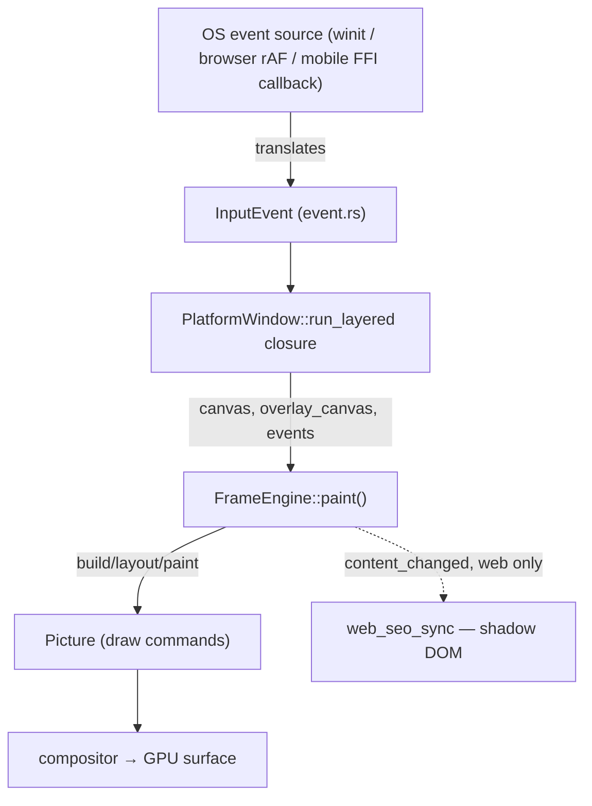

# Platform & the App Loop

> Covers `rosace-platform` (windowing/event loop) and how it drives [`FrameEngine`](../../rosace/src/engine.rs) (Layer 7) on desktop, web, and mobile.

## In one sentence

`rosace-platform` is the one place that talks to a real OS event loop (winit, or the browser, or a native mobile host) and turns whatever it hears into a plain `InputEvent` + "please paint now" call — every platform ends at the same `FrameEngine::paint(canvas, overlay_canvas, events)` call, so the rest of the framework never has to know which platform it's on.

## Mental model

Think of `rosace-platform` as a universal remote-control adapter: winit, the browser's `requestAnimationFrame`, and a mobile host's native callbacks all speak different protocols, but each is translated into the same two things — a batch of `InputEvent`s and a canvas to paint into. [`App`](../GLOSSARY.md#app)`::launch` (Layer 7) is the one piece of code that owns *both* ends: it builds the [`FrameEngine`](../../rosace/src/engine.rs) and hands it to whichever platform adapter is compiled in.

## How it works

**1. `App::launch` is the single entry point every desktop/web app goes through.** [`App::launch`](../../rosace/src/lib.rs) does startup bookkeeping (flight recorder, trace subscribers, the persistence backend, platform/theme resolution), constructs a [`FrameEngine`](../../rosace/src/engine.rs) wrapping the root `Component`, optionally spawns the dev hot-reload watcher (see [hot-reload.md](hot-reload.md)), and then calls [`PlatformWindow::run_layered`](../../rosace-platform/src/app.rs) with a closure that just calls `engine.paint(...)` every time the platform asks for a frame.

**2. [`PlatformWindow`](../../rosace-platform/src/app.rs) owns the real winit event loop.** `run_layered` builds a winit `EventLoop<FrameRequest>`, sets `ControlFlow::Wait` (the loop sleeps until something happens — this is not a busy 60fps poll), and drives an internal [`AppState`](../../rosace-platform/src/app.rs) that implements winit's `ApplicationHandler`. Every real OS event (`WindowEvent::CursorMoved`, `MouseInput`, `KeyboardInput`, `Ime`, `Touch`, scroll/pinch gestures, resize…) is translated in `AppState`'s handler into the platform-neutral [`InputEvent`](../../rosace-platform/src/event.rs) enum and queued; on `about_to_wait` (or a `RedrawRequested`) the queued batch is drained and handed to the paint closure in one call.

**3. State changes wake the loop through the same channel as OS events.** `Atom::set()` calls `rosace_state::request_frame()`, which invokes a registered wakeup closure. On desktop that closure is `event_loop.create_proxy().send_event(FrameRequest)` — winit's own mechanism for waking a `Wait`-parked loop from any thread. This is registered *before* the first frame (`run_layered`, near the top) specifically so background threads (animation timers, the hot-reload mtime poller in [`dev_host::run`](../../rosace/src/dev_host.rs)) can trigger a redraw immediately, not just user input.

**4. `FrameEngine::paint` is platform-agnostic — it's the actual frame pipeline.** [`FrameEngine::paint`](../../rosace/src/engine.rs) (Layer 7, but deliberately decoupled from `PlatformWindow`) takes a base canvas, an overlay canvas, and the frame's `InputEvent`s; it drains the dirty-component set, rebuilds only what's dirty, walks the `Element`→`Widget` tree (see [widget-protocol.md](widget-protocol.md)), lays out, paints, dispatches input to hit-tested handlers, and returns whether visible content changed. Because this one function is the whole pipeline, it's reusable outside `PlatformWindow` entirely — which is exactly what mobile does (see step 6).

**5. Two canvases, composited on the GPU.** `run_layered` (not `run`) exists because of D076 (Phase 16): a base layer canvas and a transparent overlay layer canvas are painted separately, uploaded as two GPU textures, and alpha-blended (base then overlay) at present time — this is how dialogs/menus/tooltips draw above the base content without the base content having to know about them. `run` is a backward-compatible adapter over `run_layered` for callers that only need one canvas.

**6. Mobile does not go through `PlatformWindow` at all.** `rosace-ffi` (the D106 native-host bridge) wraps `FrameEngine` directly — [`rosace-ffi/src/engine.rs`](../../rosace-ffi/src/engine.rs) owns a `rosace::FrameEngine` plus a `GpuPresenter`, and the real Swift/Kotlin host (generated by `rsc new`) calls into it across the C ABI on its own run loop (`CADisplayLink` on iOS, `Choreographer`/`GLSurfaceView` on Android) instead of winit's. `InputEvent::Lifecycle` exists specifically for this path — a mobile host reports [`LifecycleState`](../GLOSSARY.md#lifecyclestate) transitions (D042/D110) over FFI; desktop winit never sends it, since desktop app lifecycle is out of scope.

**7. Web has two different code paths, and only one of them is live.** [`rosace-platform/src/web.rs`](../../rosace-platform/src/web.rs) exports `run_web`, a single-frame MVP renderer (paints once via `putImageData`, no event loop) — but nothing in the live app path calls it (`rosace-cli`'s own `run_web`/`dev.rs` functions are unrelated CLI commands with the same name). The real web path is `PlatformWindow::run_layered` itself: under `target_arch = "wasm32"` it calls `winit::platform::web::EventLoopExtWebSys::spawn_app`, which hands the same `AppState`/winit machinery to the browser's `requestAnimationFrame` loop instead of blocking a thread (wasm cannot block). So desktop and web run *the same* `PlatformWindow` code; `web.rs`'s `run_web` is dead code left over from an earlier MVP milestone (see Gotchas).

**8. Scroll content is composited as a separate GPU layer, not re-rasterized on every scroll tick.** [`scroll_layer.rs`](../../rosace-platform/src/scroll_layer.rs) (D090) is the handoff registry: the frame loop renders each scrolling region's content into its own RGBA (or GPU-shapes) buffer and `publish`es the set; the platform's present path `take`s it and composites each as a placed layer sampled at the live scroll offset — a wheel tick becomes a UV shift, not a repaint. `take` returns `None` on frames the frame loop didn't publish (clean/skipped frames), and the platform reuses the previously retained layers so they don't flicker away on a frame-skip.

**9. Web additionally keeps a semantic HTML shadow in sync (D107).** After `engine.paint()` reports `content_changed`, `App::launch`'s web branch calls [`web_seo_sync::sync`](../../rosace-platform/src/web_seo_sync.rs), which renders the engine's semantic tree to HTML and diffs it against the previous frame's string before touching the DOM at all — two cheap gates (the caller's dirty check, then this module's own string diff) so a re-render that produces identical output never triggers a DOM write.

## Key types

- [`App`](../../rosace/src/lib.rs) — the umbrella builder (`title`/`size`/`theme`/`themes`/`platform`) whose `.launch(root)` is the only call most apps make.
- [`FrameEngine`](../../rosace/src/engine.rs) — the platform-agnostic build→layout→paint→dispatch pipeline; see [core.md](core.md) for what happens inside it.
- [`PlatformWindow`](../../rosace-platform/src/app.rs) — the winit-backed event loop wrapper; `run`/`run_layered` are its two entry points.
- [`InputEvent`](../../rosace-platform/src/event.rs) — the platform-neutral event enum every backend translates into (`MouseMove`, `KeyDown`, `Scroll`, `Pinch`, `Ime`, `Lifecycle`, …).
- [`FrameRequest`](../../rosace-platform/src/app.rs) — the winit user-event type used to wake a `Wait`-parked loop from `rosace_state::request_frame()`.
- [`ScrollLayer`](../../rosace-platform/src/scroll_layer.rs) — one scrolling region's content, handed from the frame loop to the platform's present path (D090).
- `rosace-ffi`'s engine wrapper ([`rosace-ffi/src/engine.rs`](../../rosace-ffi/src/engine.rs)) — the mobile equivalent of `PlatformWindow`, driving the same `FrameEngine` from a native host's own run loop.

## Why it's like this

- **One frame pipeline, many front doors.** `FrameEngine::paint` takes plain canvases and events, not a winit `Window` — this is what let Phase 24 (D106) reuse it verbatim behind a C ABI for real iOS/Android hosts instead of forcing mobile through winit (which cannot own an iOS app's lifecycle — see [D106 in DECISIONS.md](../DECISIONS.md)).
- **`ControlFlow::Wait`, not a redraw-every-frame loop.** The app is idle-efficient by default; only an actual OS event or an explicit `request_frame()` (from `atom.set()`, a timer, or a hot-reload swap) wakes it. This is why `register_wakeup` must run before the first frame — a background thread that fires before the wakeup closure exists would have no way to wake the loop.
- **Two-canvas layering (D076/Phase 16)** exists so overlays (dialogs, menus, tooltips, snackbars) don't force every base-content widget to reason about z-order relative to floating UI — the overlay canvas is composited on top wholesale, at the GPU.
- **The web semantic shadow (D107)** reuses the accessibility tree already built for D099 (screen readers) as the SEO source — one semantic tree, two consumers — rather than building a second parallel rendering backend just for crawlers.

## Gotchas & invariants

- **`rosace_platform::web::web_app::run_web` is dead code on the real app path.** It's exported from `rosace-platform`'s `lib.rs` and does a single, non-interactive `putImageData` paint with no event loop — nothing in `App::launch` or the generated web scaffold calls it. Don't use it as a reference for "how web actually runs"; the real path is `PlatformWindow::run_layered`'s `wasm32` branch (`EventLoopExtWebSys::spawn_app`). Two unrelated `run_web` functions also exist in `rosace-cli` (`commands/run.rs`, `commands/dev.rs`) — same name, different job (driving `rsc build --target web` / `rsc dev --target web`), not to be confused with this one.
- **Mobile lifecycle is FFI-reported, not winit-detected.** `InputEvent::Lifecycle` only ever arrives from a native host over the FFI bridge; desktop apps never receive it and must not assume `LifecycleState` transitions happen on desktop.
- **`register_wakeup` must be called before anything that might call `request_frame()`.** `App::launch` is careful to register it and request the first frame right after constructing the event loop, before spawning any hot-reload watchers or background timers — a `request_frame()` call before the wakeup closure exists is silently lost (there is no queue, only a live callback).
- **The overlay canvas is cleared to transparent every frame by the platform, not by app code.** A widget that paints into the overlay layer only needs to declare it via the normal `PaintCtx`/render-tree mechanism (see [widget-protocol.md](widget-protocol.md)) — it never needs to manage the overlay canvas's lifecycle itself.
