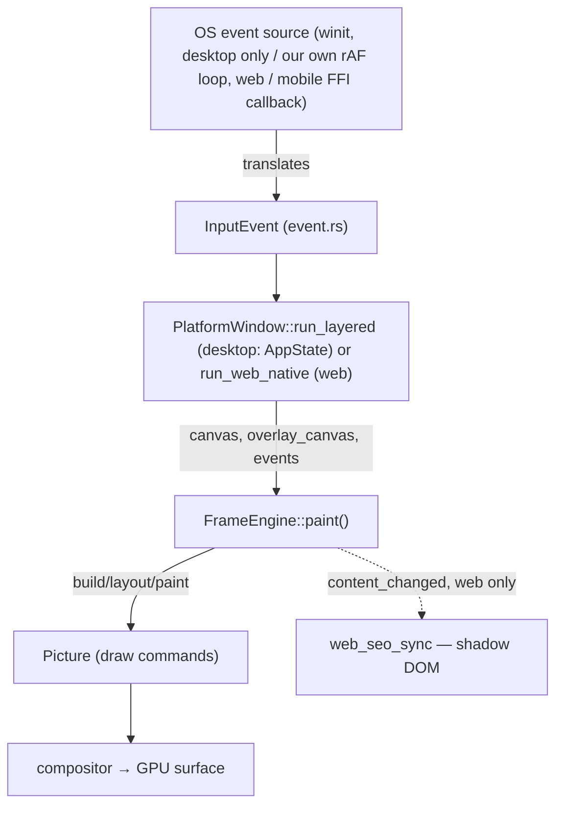

# Platform & the App Loop

> Covers `rosace-platform` (windowing/event loop) and how it drives [`FrameEngine`](../../rosace/src/engine.rs) (Layer 7) on desktop, web, and mobile.

## In one sentence

`rosace-platform` is the one place that talks to a real OS event loop (winit on desktop, our own `requestAnimationFrame` loop on the web, or a native mobile host) and turns whatever it hears into a plain `InputEvent` + "please paint now" call — every platform ends at the same `FrameEngine::paint(canvas, overlay_canvas, events)` call, so the rest of the framework never has to know which platform it's on.

## Mental model

Think of `rosace-platform` as a universal remote-control adapter: winit, the browser's `requestAnimationFrame`, and a mobile host's native callbacks all speak different protocols, but each is translated into the same two things — a batch of `InputEvent`s and a canvas to paint into. [`App`](../GLOSSARY.md#app)`::launch` (Layer 7) is the one piece of code that owns *both* ends: it builds the [`FrameEngine`](../../rosace/src/engine.rs) and hands it to whichever platform adapter is compiled in.

**winit is desktop-only.** Web used to ride winit's own `spawn_app` web support, but that event loop's `request_redraw` turned out to be coalesced/unreliable no matter how it was triggered (parked `about_to_wait`, calling it from inside the redraw handler, even an external rAF pump calling it) — queued input from our own canvas listeners rarely drained, so typing/clicks would work for a moment after load and then die once the app went idle. Web now owns its entire frame loop independently (`run_web_native`, see step 7) and never constructs winit's `AppState` at all — the two paths are cfg-gated apart (`#[cfg(not(target_arch = "wasm32"))]` on the winit side) so this isn't just "unused on web," the compiler proves it's structurally unreachable there.

```mermaid
graph TD
    OS["OS event source (winit, desktop only / our own rAF loop, web / mobile FFI callback)"] -->|translates| IE["InputEvent (event.rs)"]
    IE --> PW["PlatformWindow::run_layered (desktop: AppState) or run_web_native (web)"]
    PW -->|canvas, overlay_canvas, events| FE["FrameEngine::paint()"]
    FE -->|build/layout/paint| PIC["Picture (draw commands)"]
    PIC --> COMP["compositor → GPU surface"]
    FE -.->|content_changed, web only| SEO["web_seo_sync — shadow DOM"]
```

## How it works

**1. `App::launch` is the single entry point every desktop/web app goes through.** [`App::launch`](../../rosace/src/lib.rs) does startup bookkeeping (flight recorder, trace subscribers, the persistence backend, platform/theme resolution), constructs a [`FrameEngine`](../../rosace/src/engine.rs) wrapping the root `Component`, optionally spawns the dev hot-reload watcher (see [hot-reload.md](hot-reload.md)), and then calls [`PlatformWindow::run_layered`](../../rosace-platform/src/app.rs) with a closure that just calls `engine.paint(...)` every time the platform asks for a frame. `run_layered` itself cfg-splits immediately into the desktop path (step 2) or the web path (step 7) — from here down, steps 2–3 are desktop-only.

**2. On desktop, [`PlatformWindow`](../../rosace-platform/src/app.rs) owns the real winit event loop.** `run_layered` builds a winit `EventLoop<FrameRequest>`, sets `ControlFlow::Wait` (the loop sleeps until something happens — this is not a busy 60fps poll), and drives an internal [`AppState`](../../rosace-platform/src/app.rs) that implements winit's `ApplicationHandler`. Every real OS event (`WindowEvent::CursorMoved`, `MouseInput`, `KeyboardInput`, `Ime`, `Touch`, scroll/pinch gestures, resize…) is translated in `AppState`'s handler into the platform-neutral [`InputEvent`](../../rosace-platform/src/event.rs) enum and queued; on `about_to_wait` (or a `RedrawRequested`) the queued batch is drained and handed to the paint closure in one call. `AppState`/`ApplicationHandler` and everything inside them are `#[cfg(not(target_arch = "wasm32"))]` — web never builds this code at all.

**3. State changes wake the desktop loop through the same channel as OS events.** `Atom::set()` calls `rosace_state::request_frame()`, which invokes a registered wakeup closure. On desktop that closure is `event_loop.create_proxy().send_event(FrameRequest)` — winit's own mechanism for waking a `Wait`-parked loop from any thread — and `AppState`'s `about_to_wait` handler checks `take_frame_requested()` before deciding to redraw. This is registered *before* the first frame (`run_layered`, near the top) specifically so background threads (animation timers, the hot-reload mtime poller in [`dev_host::run`](../../rosace/src/dev_host.rs)) can trigger a redraw immediately, not just user input. **Web's rAF loop never checks this flag at all** — it runs every tick unconditionally (see step 7). `queue_web_input` still calls `request_frame()` on every canvas event (a holdover from when web rode winit's wakeup path); it's harmless on web since nothing reads the flag there, just vestigial.

**4. `FrameEngine::paint` is platform-agnostic — it's the actual frame pipeline.** [`FrameEngine::paint`](../../rosace/src/engine.rs) (Layer 7, but deliberately decoupled from `PlatformWindow`) takes a base canvas, an overlay canvas, and the frame's `InputEvent`s; it drains the dirty-component set, rebuilds only what's dirty, walks the widget tree (see [widget-protocol.md](widget-protocol.md)), lays out, paints, dispatches input to hit-tested handlers, and returns whether visible content changed. Because this one function is the whole pipeline, it's reusable outside `PlatformWindow` entirely — which is exactly what mobile does (see step 6).

**5. Two canvases, composited on the GPU.** `run_layered` (not `run`) exists because of D076 (Phase 16): a base layer canvas and a transparent overlay layer canvas are painted separately, uploaded as two GPU textures, and alpha-blended (base then overlay) at present time — this is how dialogs/menus/tooltips draw above the base content without the base content having to know about them. `run` is a backward-compatible adapter over `run_layered` for callers that only need one canvas.

**6. Mobile does not go through `PlatformWindow` at all.** `rosace-ffi` (the D106 native-host bridge) wraps `FrameEngine` directly — [`rosace-ffi/src/engine.rs`](../../rosace-ffi/src/engine.rs) owns a `rosace::FrameEngine` plus a `GpuPresenter`, and the real Swift/Kotlin host (generated by `rsc new`) calls into it across the C ABI on its own run loop (`CADisplayLink` on iOS, `Choreographer`/`GLSurfaceView` on Android) instead of winit's. `InputEvent::Lifecycle` exists specifically for this path — a mobile host reports [`LifecycleState`](../GLOSSARY.md#lifecyclestate) transitions (D042/D110) over FFI; desktop winit never sends it, since desktop app lifecycle is out of scope.

**7. Web owns its entire frame loop independently — no winit involved.** Under `target_arch = "wasm32"`, `run_layered` calls `run_web_native` instead of building a winit `EventLoop`. `run_web_native` creates the `<canvas>` itself, appends it to the page, sizes it to the viewport, builds the wgpu surface straight from that canvas (`GpuPresenter::new_async_canvas` — the compositor has a dedicated constructor for this, splitting surface creation from the rest of `GpuPresenter::new`'s shared setup), wires our own `keydown`/`keyup`/`pointerdown`/`pointermove`/`pointerup`/`wheel` listeners on the canvas (`wire_web_input` — the browser does not reliably deliver these to a winit-owned element), and then drives frames from a **self-rescheduling `requestAnimationFrame` callback** that calls `web_native_frame` directly: drain the input queue, call the paint closure, present via the GPU compositor, `request_animation_frame` itself again. Every tick runs the full pipeline unconditionally — there is no `ControlFlow::Wait`-style idle gate on web (the per-frame dirty-tracking inside `FrameEngine`/the compositor still skips the expensive parts of a frame where nothing changed; what's guaranteed here is just that the *loop itself* never stalls). State (`WebState`: the presenter, both canvases, scroll layers, retained frame items) lives in an `Rc<RefCell<..>>` captured by the rAF closure, since nothing else needs to touch it.

**8. Scroll content is composited as a separate GPU layer, not re-rasterized on every scroll tick.** [`scroll_layer.rs`](../../rosace-platform/src/scroll_layer.rs) (D090) is the handoff registry: the frame loop renders each scrolling region's content into its own RGBA (or GPU-shapes) buffer and `publish`es the set; the platform's present path `take`s it and composites each as a placed layer sampled at the live scroll offset — a wheel tick becomes a UV shift, not a repaint. `take` returns `None` on frames the frame loop didn't publish (clean/skipped frames), and the platform reuses the previously retained layers so they don't flicker away on a frame-skip.

**9. `MediaQuery` (D126/D127) is pushed from a real OS notification on every platform, never polled.** `rosace_core::set_media_query(mq)` is the one shared entry point every native host calls into: desktop's `AppState` translates winit's `WindowEvent::ThemeChanged` (step 2's event stream); web registers a `window.matchMedia(...)` `"change"` listener per media feature (`prefers-color-scheme`, `prefers-reduced-motion`) inside `run_web_native`'s setup; iOS/Android don't go through `PlatformWindow` at all (step 6) — their generated native host overrides `traitCollectionDidChange`/`onConfigurationChanged` and calls across the FFI boundary into `rosace-ffi`'s `Engine::set_media_query`, which just forwards to the same `rosace_core::set_media_query`. All four paths pair the call with `rosace_theme::sync_system_theme()` so OS-brightness changes apply to the active theme in the same step (unless the app pinned a `ThemeMode`, see [theming.md](../guide/theming.md)).

**10. Web additionally keeps a semantic HTML shadow in sync (D107).** After `engine.paint()` reports `content_changed`, `App::launch`'s web branch calls [`web_seo_sync::sync`](../../rosace-platform/src/web_seo_sync.rs), which renders the engine's semantic tree to HTML and diffs it against the previous frame's string before touching the DOM at all — two cheap gates (the caller's dirty check, then this module's own string diff) so a re-render that produces identical output never triggers a DOM write.

## Key types

- [`App`](../../rosace/src/lib.rs) — the umbrella builder (`title`/`size`/`theme`/`themes`/`platform`) whose `.launch(root)` is the only call most apps make.
- [`FrameEngine`](../../rosace/src/engine.rs) — the platform-agnostic build→layout→paint→dispatch pipeline; see [core.md](core.md) for what happens inside it.
- [`PlatformWindow`](../../rosace-platform/src/app.rs) — the entry point for both desktop and web; `run`/`run_layered` are its two calls, which internally split into the winit path (desktop) or `run_web_native` (web).
- [`AppState`](../../rosace-platform/src/app.rs) — winit's `ApplicationHandler` impl; **desktop-only**, `#[cfg(not(target_arch = "wasm32"))]`, never constructed on web.
- `run_web_native` / `WebState` (both in [`rosace-platform/src/app.rs`](../../rosace-platform/src/app.rs)) — web's independent frame loop and the state its self-rescheduling rAF closure carries (GPU presenter, both canvases, retained scroll layers/frame items). `#[cfg(target_arch = "wasm32")]`.
- [`InputEvent`](../../rosace-platform/src/event.rs) — the platform-neutral event enum every backend translates into (`MouseMove`, `KeyDown`, `Scroll`, `Pinch`, `Ime`, `Lifecycle`, …).
- [`FrameRequest`](../../rosace-platform/src/app.rs) — the winit user-event type used to wake a `Wait`-parked **desktop** loop from `rosace_state::request_frame()`. Web has no equivalent — its loop never parks.
- [`ScrollLayer`](../../rosace-platform/src/scroll_layer.rs) — one scrolling region's content, handed from the frame loop to the platform's present path (D090).
- `rosace-ffi`'s engine wrapper ([`rosace-ffi/src/engine.rs`](../../rosace-ffi/src/engine.rs)) — the mobile equivalent of `PlatformWindow`, driving the same `FrameEngine` from a native host's own run loop.
- [`MediaQuery`](../../rosace-core/src/media_query.rs) — OS accessibility/appearance signals (`is_dark`, `text_scale`, `bold_text`, `reduce_motion`, `always_24_hour_format`), pushed by every native host through `rosace_core::set_media_query`; see step 9 and [System Environment](../guide/environment.md).

## Why it's like this

- **One frame pipeline, many front doors.** `FrameEngine::paint` takes plain canvases and events, not a winit `Window` — this is what let Phase 24 (D106) reuse it verbatim behind a C ABI for real iOS/Android hosts instead of forcing mobile through winit (which cannot own an iOS app's lifecycle — see [D106 in DECISIONS.md](../DECISIONS.md)), and what let web drop winit entirely without touching `FrameEngine` at all.
- **`ControlFlow::Wait` on desktop, not a redraw-every-frame loop.** The desktop app is idle-efficient by default; only an actual OS event or an explicit `request_frame()` (from `atom.set()`, a timer, or a hot-reload swap) wakes it. This is why `register_wakeup` must run before the first frame — a background thread that fires before the wakeup closure exists would have no way to wake the loop.
- **Web trades idle-efficiency for reliability.** winit-web's `request_redraw` could not be made to fire reliably (see step 7's history above) — every fix attempted (`ControlFlow::Poll`, an external rAF pump calling `request_redraw`) still relied on winit's internal coalescing behavior and still lost input. The only fix that actually worked was to stop asking winit to redraw and call the frame logic directly from our own rAF. The tradeoff is that web now always runs a full rAF tick instead of parking like desktop — acceptable since browsers already throttle/pause rAF for hidden tabs, and the frame pipeline's own dirty-tracking still skips real work on unchanged frames.
- **Two-canvas layering (D076/Phase 16)** exists so overlays (dialogs, menus, tooltips, snackbars) don't force every base-content widget to reason about z-order relative to floating UI — the overlay canvas is composited on top wholesale, at the GPU.
- **The web semantic shadow (D107)** reuses the accessibility tree already built for D099 (screen readers) as the SEO source — one semantic tree, two consumers — rather than building a second parallel rendering backend just for crawlers.

## Gotchas & invariants

- **Two structurally separate frame loops, not one loop with an if-web branch.** `AppState`/`ApplicationHandler` (desktop) and `run_web_native`/`WebState` (web) are different types with different lifecycles, cfg-gated apart so each only exists on its own target. A change to one does not automatically apply to the other — e.g. the desktop animated-quad re-request timer (`std::thread::spawn` + 33ms sleep) has no web equivalent because web's loop already re-fires every rAF tick unconditionally.
- **`std::thread::spawn` aborts the wasm32 module — there are no threads there.** This bit real functionality: focusing a text field used to crash the whole app on web, because the long-press-select timer in `rosace/src/engine.rs` (and the `Toast`/`Snackbar` auto-dismiss timers in `rosace-widgets`) called `std::thread::spawn` directly. Fixed via `rosace_state::fire_after_ms(ms, f)` — a timer thread on native, `setTimeout` via web-sys on wasm. Any *new* delayed-callback code must go through this helper, never a raw `thread::spawn`, or it will compile fine on desktop and crash on web the first time it actually runs.
- **Mobile lifecycle is FFI-reported, not winit-detected.** `InputEvent::Lifecycle` only ever arrives from a native host over the FFI bridge; desktop apps never receive it and must not assume `LifecycleState` transitions happen on desktop.
- **`register_wakeup` must be called before anything that might call `request_frame()` — desktop only.** `App::launch`'s desktop path is careful to register it and request the first frame right after constructing the event loop, before spawning any hot-reload watchers or background timers — a `request_frame()` call before the wakeup closure exists is silently lost (there is no queue, only a live callback). Web doesn't register a wakeup at all; `request_frame()` on web just sets the dirty flag that the next (already-scheduled) rAF tick will observe.
- **Web's wheel-scroll input is not yet fully wired.** Click, drag-pan-to-scroll (with momentum), and typing all work through the canvas input listeners; mouse-wheel scroll events are received but don't yet move ROSACE's own scroll views — a known, still-open gap (not a regression from the winit removal; scoped separately).
- **A `GlobalAtom` write has no per-component subscribers, so `set_media_query`/`set_theme` must force a repaint themselves.** Unlike a `ctx.state()` atom read inside `build()`, `MediaQuery`/`ThemeData` are read via free functions (`use_media_query`/`use_theme`) with no dirty-tracking subscription — a plain atom write is a silent no-op in the dirty graph. A push from OUTSIDE input dispatch (a native OS callback firing between frames, not a widget click) has no other event to ride along on to trigger a real repaint. This shipped as a real bug once (a theme change from the OS applied after an unpredictable multi-second delay, waiting on the next unrelated mouse move or animation tick) — fixed by having both `set_media_query` (`rosace-core/src/media_query.rs`) and `sync_system_theme`/`set_theme_mode` (`rosace-theme/src/provider.rs`) call `rosace_state::reset_to_global_dirty()` themselves, so each is correct on its own and doesn't depend on a caller pairing it with something else that happens to dirty the tree.
- **The overlay canvas is cleared to transparent every frame by the platform, not by app code.** A widget that paints into the overlay layer only needs to declare it via the normal `PaintCtx`/render-tree mechanism (see [widget-protocol.md](widget-protocol.md)) — it never needs to manage the overlay canvas's lifecycle itself.
