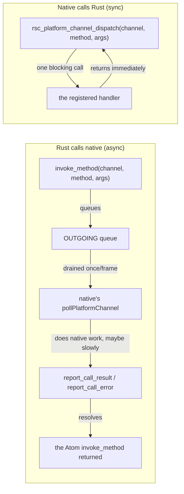

# Platform Channel

> Covers `rosace-ffi`'s `platform_channel` module (`dispatch.rs` + `outgoing.rs`) and how `rsc new`'s generated native glue (`ios/App/EngineViewController.swift`, `android/.../MainActivity.kt`) wires into it.

## In one sentence

Platform Channel is a named, bidirectional bridge that lets your Rust app code call native platform APIs (and native code call back into Rust) without ROSACE needing first-class support for every OS feature — the same idea as Flutter's `MethodChannel`, built on the same request/result plumbing that already proved itself for camera and push-notification permissions.

## Mental model

Think of a channel as a named mailbox both sides agree on ahead of time — a string like `"dev.rosace.myapp/battery"`. Either side can drop a JSON-encoded message in with a method name and arguments; the other side picks it up, does its platform-specific work, and drops an answer back. There are two independent mailboxes, because the two directions have very different timing constraints:

## How it works

**1. Two call shapes, chosen by who's waiting on what.** [`dispatch.rs`](../../rosace-ffi/src/platform_channel/dispatch.rs) is native calling Rust — one blocking FFI call, answered inline by a handler the app registered with [`set_method_call_handler`](../../rosace-ffi/src/platform_channel/dispatch.rs). This is the *fast* path: use it only when the answer is ready before the call returns (native has no way to "come back later" here). [`outgoing.rs`](../../rosace-ffi/src/platform_channel/outgoing.rs) is Rust calling native — the call is queued, and native answers whenever its own work finishes, which might be many frames later (a system permission dialog, waiting on the user). This is the common direction for "ask the OS for something."

**2. The async path reuses the exact reactivity every other piece of ROSACE state already has.** [`invoke_method`](../../rosace-ffi/src/platform_channel/outgoing.rs) mints a fresh [`Atom<ChannelCallState>`](../../rosace-ffi/src/platform_channel/outgoing.rs) (via `rosace_state::next_atom_id()`, the same id-minting `ctx.state` uses internally) and returns it immediately, holding `Pending`. A component reading `.get()` on that atom inside `build()` auto-subscribes to it — so when native eventually calls [`report_call_result`](../../rosace-ffi/src/platform_channel/outgoing.rs)/`report_call_error`, the atom resolves to `Resolved(value)`/`Failed(message)` and the UI updates on its own. No polling loop, no callback registration on the Rust side — this is not a new "async" primitive, it's [`rosace-net`'s `use_query`](state-and-reactivity.md) pattern (a background worker writes an atom on completion) with the "background worker" being native code instead of a Rust thread.

**3. Native drains the queue with its own regular frame tick — nothing new to schedule.** [`take_outgoing_calls`](../../rosace-ffi/src/platform_channel/outgoing.rs) is polled once per tick (iOS: `CADisplayLink`'s `tick()`; Android: the `Choreographer.FrameCallback`), the exact same cadence that already drives `rsc_engine_frame`. It returns every call queued since the last poll as a JSON array of `{call_id, channel, method, args}` objects — native's own JSON parser (`JSONSerialization`/`org.json`) decodes it, no extra dependency needed on either platform.

**4. Camera and push permissions are Platform Channel users, not a separate mechanism.** [`rosace-ffi::capability`](../../rosace-ffi/src/capability.rs)'s `request_camera`/`request_push_permission` call `invoke_method` internally — the *discovery* half goes through the same generic queue. Result-reporting stays a plain setter (`report_camera_result(bool)`), not `report_call_result`/`call_id`, because a singleton capability (never more than one camera permission in flight) doesn't need correlation — that's a deliberate simplification specific to those two, not a rule for your own channels with genuinely concurrent calls.

**5. Memory crossing the boundary is owned, and freed exactly once.** Every JSON string this crate hands to native (the outgoing-calls array, a `dispatch` result) is a heap-allocated `CString`/`JString` the receiver must free after copying its bytes into a native string — `rsc_string_free` on iOS (JNI's `JString` is garbage-collected, no manual free needed on Android). Same discipline `AndroidSurfaceHandle`'s `Drop` already follows for its native-window reference.

## Key types

- [`MethodHandler`](../../rosace-ffi/src/platform_channel/dispatch.rs) — `Box<dyn Fn(&str, Value) -> Result<Value, String> + Send + Sync>`, what you register for the sync (native-calls-Rust) direction.
- [`ChannelCallState`](../../rosace-ffi/src/platform_channel/outgoing.rs) — `Pending`/`Resolved(Value)`/`Failed(String)`, what an `invoke_method` call's `Atom` holds.
- [`OutgoingCall`](../../rosace-ffi/src/platform_channel/outgoing.rs) — one queued call (`call_id`, `channel`, `method`, `args_json`), what native's per-frame poll gets back.
- `rsc_platform_channel_take_outgoing`/`_report_result`/`_report_error`/`_dispatch` + `rsc_string_free` — the five FFI exports `rsc new` generates per app (in `src/ffi.rs`), the actual ABI native calls across.

## Why it's like this

- **Async by default, even for calls that answer instantly.** `invoke_method` is the right choice for *any* native call, not just slow ones — a call that's always fast today might not stay that way, and there's no cheap way to "upgrade" a sync call to async later without changing the calling code. See [D127](../DECISIONS.md).
- **No new dependency for the async model.** Platform Channel doesn't introduce a Future/callback abstraction — it reuses the atom-write-wakes-subscribers mechanism that already exists for every other piece of reactive state, which is also why it needed zero changes to the render/dirty-tracking pipeline.
- **`serde_json`, not a hand-rolled format.** Both native platforms already have a built-in JSON parser; inventing a different wire format would mean writing (and maintaining) a worse one for no benefit. See D127's dependency-discipline note.
- **Camera stays opt-in, not baked into the generator.** Wiring `"rosace/camera"` into every generated app's native tick loop would add an unused `NSCameraUsageDescription` to every app's Info.plist, whether or not it touches the camera — see `rosace-ffi::capability`'s module doc.

## Gotchas & invariants

- **Mobile's native entry points never call `launch()`.** `rsc_engine_init` (iOS) and `nativeInit` (Android) construct the engine directly; any one-time setup — including registering a Platform Channel handler — must go in `app_init()` (called from *every* entry point, not just `launch`), or it silently never runs on iOS/Android. This bit real functionality once — see D127.
- **A registered handler must answer fast.** `dispatch` blocks the calling native thread until your handler returns. Anything that might take a moment belongs on the `invoke_method` side instead.
- **`call_id`s are never reused** (a monotonically increasing counter), so a stale or duplicate `report_call_result`/`_error` for an already-resolved or unknown id is a harmless no-op, not a correctness hazard.
- **Nothing polls the outgoing queue on desktop or web yet.** `invoke_method` calls there will sit in `Pending` forever — this is a known gap (native's per-frame poll is currently generated for iOS/Android only), not a bug in your app.
