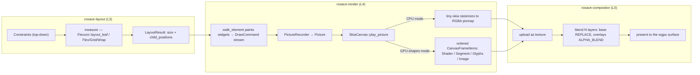

# Render Pipeline: Layout, Paint, Composite

> Covers `rosace-layout` (Layer 3), `rosace-render` (Layer 4), and `rosace-compositor` (Layer 0 — no `rosace-*` deps, despite being consumed at the top of the stack). This is the second half of the frame pipeline in [README.md](README.md); [core.md](core.md) covers what feeds into it (the `Element` tree) and [state-and-reactivity.md](state-and-reactivity.md) covers what triggers it.

## In one sentence

Once `rosace-core` decides which components to rebuild, `rosace-layout` measures and places the resulting widget tree, `rosace-render` turns that into a flat list of draw commands and rasterizes (or GPU-batches) them onto pixel buffers, and `rosace-compositor` uploads those buffers as textures and blends them onto the screen.

## Mental model

Think of it as three independent departments that only talk through plain data, never through shared mutable state: layout hands paint a set of `(size, position)` pairs; paint hands the compositor one or more RGBA pixel buffers (or, in GPU-shapes mode, a list of pre-batched draw items); the compositor's only job is uploading and blending rectangles of pixels. None of the three needs to know *why* a frame happened — that's `rosace-core`/`rosace-state`'s job.

## How it works

**1. Layout runs on `Constraints`, top-down then bottom-up.** [`Constraints`](../../rosace-layout/src/constraints.rs) (re-exported from `rosace-core`) carries `min_width`/`max_width`/`min_height`/`max_height` with an [`AxisBound`](../../rosace-core/src/render_object.rs) of `Bounded(f32) | Unbounded | Shrink` per axis (D014's three-pass model: measure top-down, place bottom-up, paint). [`Flexure::layout_leaf`](../../rosace-layout/src/flexure.rs) is the base case — clamp a natural size into the constraints and return an empty-children [`LayoutResult`](../../rosace-layout/src/layout_result.rs). Container layout (`Column`/`Row`/`Grid`/`Wrap`) lives under [`rosace-layout/src/widgets/`](../../rosace-layout/src/widgets/) and calls back into `Flexure`-style measurement per child.

**2. [`Width`/`Height`](../../rosace-layout/src/sizing.rs) are the declarative sizing vocabulary.** `Fixed`, `Fill`, `Shrink`, `Fraction(f32)`, `Min`/`Max`/`Range` each convert to an `AxisBound` given the parent's available space — `Fraction` is explicitly of *available* space, not the screen (D015). [`MainAxisAlignment`/`CrossAxisAlignment`](../../rosace-layout/src/alignment.rs) (D017's baseline alignment, `SpaceBetween`/`SpaceAround`/`SpaceEvenly`) drive how `layout_row`/`layout_column` distribute the resolved sizes.

**3. Paint is a tree walk that never writes pixels directly.** Widgets don't touch a pixel buffer — they push [`DrawCommand`](../../rosace-render/src/draw_command.rs) values (`FillRect`, `FillRRect`, `FillCircle`, `FillGradient`, `FillArc`, `DrawText`, `DrawShadow`, `BlitRgba`, `PushClip`/`PopClip`, `BackdropBlur`, `ShaderFill`) into a [`PictureRecorder`](../../rosace-render/src/picture.rs), which seals into an immutable [`Picture`](../../rosace-render/src/picture.rs) — a plain `Vec<DrawCommand>`. This is what makes replay-without-repaint possible: scrolling, animation frames, and Hero-transition morphs (`DrawCommand::morph`, remapping a captured `Picture` from one rect to another) all replay a `Picture` instead of re-running any widget's paint logic.

**4. `SkiaCanvas::play_picture` is where a `Picture` becomes pixels — in one of two modes.** [`SkiaCanvas`](../../rosace-render/src/canvas.rs) is backed by `tiny-skia` (a pure-Rust CPU rasterizer, D032's "Skia" decision realized as `tiny-skia` rather than `skia-safe`). Two modes coexist on the same type today:
   - **CPU mode (default):** every `DrawCommand` rasterizes straight into the canvas's `Pixmap` via `tiny-skia` calls — anti-aliased rounded-rect fills, kerned text blitting, Gaussian-approximated shadows, clip masks.
   - **GPU-shapes mode (`set_gpu_shapes(true)`, D109/Phase 27):** the eight built-in shape commands divert to registered [SDF](../GLOSSARY.md#signed-distance-field-sdf) [pipelines](../GLOSSARY.md#gpu-pipeline-render-pipeline) instead of `tiny-skia`, and `play_picture` partitions the command stream into ordered [`CanvasFrameItem`](../../rosace-render/src/canvas.rs)s — `Shader` (a GPU quad), `Segment` (a CPU-rasterized bbox cut from the scratch [pixmap](../GLOSSARY.md#pixmap--rgba-buffer), for anything without a GPU pipeline yet), `Glyphs` (a batch of [glyph-atlas](../GLOSSARY.md#glyph-atlas)-cached glyph quads), or `Image`. Ordering is preserved so a shape→text→shape stack still z-orders correctly even though the three item kinds execute through different GPU paths. GPU-shapes mode is enabled per-canvas by the platform, only where a `GpuPresenter` exists.

**5. Text goes through one shared glyph-placement walk.** [`layout_glyphs`](../../rosace-render/src/font.rs) computes [kerning, baseline, and bearing](../GLOSSARY.md#baseline-bearing-kerning) once and is used by *both* the CPU blit path and the GPU atlas-collect path, specifically so the two can't drift glyph-for-glyph. `FontCache` (D019: fontdue rasterization) caches each distinct glyph rasterization once (`CachedGlyph = Arc<(fontdue::Metrics, Vec<u8>)>`), keyed stably by `px_bits << 32 | char << 1 | wants_bold` — the same key the GPU atlas uses to avoid re-uploading a glyph it's already seen. Color emoji glyphs (`ColorGlyph`) skip the [coverage-mask](../GLOSSARY.md#coverage-mask) path entirely and reuse the RGBA blit pipeline instead of a second atlas page.

**6. HiDPI is a single scale factor applied at replay time, never baked into recorded commands.** `SkiaCanvas` stores a `scale` ([device pixel ratio](../GLOSSARY.md#device-pixel-ratio--hidpi--scale-factor)); every `DrawCommand` is recorded in **logical** pixels and `play_picture` multiplies by `scale` when it actually draws, so the same recorded `Picture` is correct whether replayed on a 1x or 2x (Retina) canvas. `SkiaCanvas::new_hidpi(phys_width, phys_height, scale)` is the HiDPI constructor.

**7. Frame-skip and damage-rect are two separate optimizations layered on top of the same walk.** In [`FrameEngine::paint`](../../rosace/src/engine.rs): `needs_paint` (global-dirty OR any dirty component OR a fresh/resized canvas OR a forced hover repaint) gates whether painting happens **at all** this frame — a fully idle frame skips build, walk, and rasterization entirely. When painting does happen, `full_repaint` (global-dirty OR resize OR fresh canvas OR GPU-shapes mode, which is *always* a full repaint since damage-scoped clearing is a CPU-buffer economy that doesn't apply to a re-expressed ordered-item list) decides between clearing the whole canvas versus clearing and replaying only the **damaged region** — the union of old/new rects for every repainted widget, accumulated by `walk_element` in [`rosace/src/lib.rs`](../../rosace/src/lib.rs) and inflated by 24px on each side to cover pixels a widget paints outside its own layout rect (shadows, focus rings).

**8. `rosace-compositor` only ever sees pixel buffers and quads — never widgets.** [`GpuPresenter`](../../rosace-compositor/src/lib.rs) is [wgpu](../GLOSSARY.md#wgpu)-backed (D072: wgpu over raw Vulkan/Metal/DX12, so the right native backend is picked per-OS at runtime) and is a **Layer 0** crate with a hard "zero `rosace-*` deps" contract — it takes `CompositorLayer`s (raw pixel slices + width/height/opacity/dirty flag), `ShaderQuad`s, `AtlasGlyph`s, and `ImageQuad`s, all primitive types. `rosace-platform` is the only thing that imports both `rosace-compositor` and the typed shader/widget crates, and converts between them at that boundary. `present_layers` composites bottom-to-top: the base layer with `REPLACE` [blend](../GLOSSARY.md#blend-mode-porter-duff), every overlay layer with [Porter-Duff](../GLOSSARY.md#blend-mode-porter-duff) `ALPHA_BLENDING` over it (D076).
   - **GPU texture caching (D089, landed Phase 20):** each layer slot holds a persistent `wgpu::Texture` + bind group across frames. A clean, unmoved layer re-uses its texture untouched (no `write_texture` call); an offset-only change (scroll) is a cheap uniform buffer write; a frame where every layer is clean skips presenting entirely. Dirtiness flows from `SkiaCanvas::frame_dirty` (set whenever the frame loop actually repaints that canvas) through the platform into `CompositorLayer::tracked`.
   - **Placed/scroll layers (D090):** a `CompositorLayer::placed(...)` positions a quad at a screen-space rect and samples a content-sized [texture](../GLOSSARY.md#texture) at a [UV offset](../GLOSSARY.md#uv-mapping) — this is the mechanism behind [state-and-reactivity.md](state-and-reactivity.md)'s "scroll produces no CPU paint" (`rosace_state::scroll_offset` feeds the UV offset directly; the content texture is untouched).

## Key types

- [`Constraints`](../../rosace-layout/src/constraints.rs) / [`AxisBound`](../../rosace-core/src/render_object.rs) — the top-down sizing contract every widget's layout receives.
- [`Flexure`](../../rosace-layout/src/flexure.rs) — the leaf-case layout primitive; container layout (`Flex`/`Grid`/`Wrap`) lives in [`rosace-layout/src/widgets/`](../../rosace-layout/src/widgets/).
- [`LayoutResult`](../../rosace-layout/src/layout_result.rs) — resolved `size` + per-child `Point` positions.
- [`DrawCommand`](../../rosace-render/src/draw_command.rs) — the paint-pass instruction set; the one thing widgets actually emit.
- [`Picture`](../../rosace-render/src/picture.rs) / [`PictureRecorder`](../../rosace-render/src/picture.rs) — the recorded, replayable command list.
- [`SkiaCanvas`](../../rosace-render/src/canvas.rs) — CPU rasterizer (`tiny-skia`) *and* GPU-shapes command partitioner, depending on mode.
- [`FontCache`](../../rosace-render/src/font.rs) — fontdue-backed glyph rasterization + cache; shared by CPU blit and GPU atlas paths via [`layout_glyphs`](../../rosace-render/src/font.rs).
- [`GpuPresenter`](../../rosace-compositor/src/lib.rs) — wgpu surface owner; uploads/caches textures and composites layers.
- [`CompositorLayer`](../../rosace-compositor/src/lib.rs) — the primitive-typed interface between the frame loop and the compositor.

## Why it's like this

- **Three-pass Flexure layout (measure/place/paint), not a single recursive pass.** [D013](../DECISIONS.md)/[D014](../DECISIONS.md) split layout from paint explicitly so a widget's size can be resolved before anything is drawn — required for alignment, `Fraction` sizing relative to a parent, and intrinsic sizing (D016, opt-in only, zero cost when unused).
- **`tiny-skia`, not `skia-safe`.** [D032](../DECISIONS.md) locked "Skia" as the renderer, but the actual dependency is `tiny-skia` — a pure-Rust CPU-only reimplementation of Skia's software backend, not the full `skia-safe` C++ binding. This is a real deviation from the letter of D032, not a documentation gap; it's what made D109 (below) necessary once animation made CPU rasterization the bottleneck.
- **Moving off `tiny-skia` onto GPU shaders is a scoped, in-progress migration, not a rewrite.** [D109](../DECISIONS.md) (`.steering/DECISIONS.md`, Phase 27, status **scoped, not fully complete**) is the decision behind GPU-shapes mode: every built-in shape becomes a registered `wgpu::RenderPipeline` (SDF fragment shader, no CPU tessellation), text moves to a cached GPU glyph atlas built on the *existing* `FontCache` (explicitly not by adopting `cosmic-text`/`glyphon` as dependencies — glyphon is cited as prior art for the mechanism only). The reasoning cites Flutter's Impeller, Compose's Skia-GPU backend, and SwiftUI's Metal compositing as the field's converged answer, and ties it directly to D108's pervasive default animation: an animated widget is dirty every frame by construction, so damage-rect/frame-skip (which only help idle apps) can't hide the CPU rasterization cost. `tiny-skia` is deliberately **not deleted** in this phase — it stays as the desktop softbuffer fallback and the entire web/wasm path (which never touches the GPU at all, per D109's own caveat).
- **The compositor is a strict Layer 0 crate with zero `rosace-*` dependencies.** This is what forces `ShaderFill`'s `pipeline_id`/`uniforms` to be raw `u64`/`Vec<u8>` instead of typed `PipelineId`/`ShaderUniforms` — `rosace-compositor` cannot import `rosace-shader`'s types even though it's the thing that ultimately compiles and runs the pipelines. `rosace-platform` (already the compositor's only consumer) does the typed-to-primitive conversion at the boundary. See [D109](../DECISIONS.md) and the layer-cake rule in [README.md](README.md).
- **The sRGB gamma bug is why texture format matters more than D073/D075 originally assumed.** D073/D075 locked `Rgba8Unorm` with "no sRGB correction (tiny-skia already handles gamma)" — but `tiny-skia`'s output bytes are gamma-encoded sRGB, and uploading them as plain `Unorm` (not `*Srgb`) meant the GPU never linearized them before the sRGB-format swapchain re-encoded on write, double-applying the gamma curve. Fixed 2026-07-08 by switching the layer texture format to `Rgba8UnormSrgb` (see the fix's own comment in [`rosace-compositor/src/lib.rs`](../../rosace-compositor/src/lib.rs)), verified by sampling actual rendered pixels (`#2B2D30` was rendering as `(96,98,102)`, the exact shape of a doubled sRGB curve). Documented in [project_render_gamma_fix](../../.steering/DECISIONS.md) territory — a concrete case where "the code disagrees with the decision doc" and the code (once fixed) wins.

## Gotchas & invariants

- **`DrawCommand`s are recorded in logical pixels; only `play_picture` scales to physical.** If you're adding a new `DrawCommand` variant, it must be threaded through both `offset()` (Hero/damage translation) and `morph()` (Hero transitions) — every existing variant is, by design (see D109's note on `ShaderFill`'s API surface).
- **`ShaderFill` has no CPU rasterization path, on purpose.** `SkiaCanvas::play_picture` never draws it — it only *collects* it into `pending_shader_quads`/`CanvasFrameItem::Shader`, physical-px, with the widget clip stack captured at record time. Forgetting to drain `take_shader_quads()`/`take_frame_items()` each frame silently leaks GPU quads across frames.
- **GPU-shapes mode is always a full repaint.** Damage-rect clearing is a CPU-pixel-buffer economy; once the frame is re-expressed as an ordered item list, there's no "dirty rectangle" of a texture to partially replay. Don't expect damage-rect logs/behavior when `canvas.gpu_shapes()` is true.
- **A `Picture` replayed on a different canvas scale is still correct — a `Picture` replayed with a different logical size is not.** Coordinates are logical; `play_picture` only ever multiplies by `scale`. If you cache a `Picture` and reuse it after a layout change, you must re-record, not just re-scale.
- **`RefreshEngine`-style fine-grained rebuild determines *what* gets rebuilt before layout ever runs — layout itself has no dirty-tracking of its own.** A component that's marked clean skips `build()` entirely (see [state-and-reactivity.md](state-and-reactivity.md)) and its cached `Element` still goes through the *full* layout+paint walk that frame unless the containing subtree is also skipped by frame-skip. Layout is not memoized per-node the way build is.
- **`Rgba8UnormSrgb`, not `Rgba8Unorm`, is required for correct color on the compositor's cached layer textures.** If you ever add a new texture upload path in `rosace-compositor`, match the existing `.find(|f| f.is_srgb())` surface-format query and the `*Srgb` texture format — reintroducing plain `Unorm` reproduces the exact double-gamma bug described above.
- **Web/wasm never constructs a `GpuPresenter`.** `rosace-platform`'s web target presents via 2D-canvas `putImageData`, so GPU-shapes mode and the wgpu compositor path are desktop/mobile-only until a WebGPU presenter is scoped as its own phase (named in D109). Don't assume GPU-shapes behavior when reasoning about the web target.
