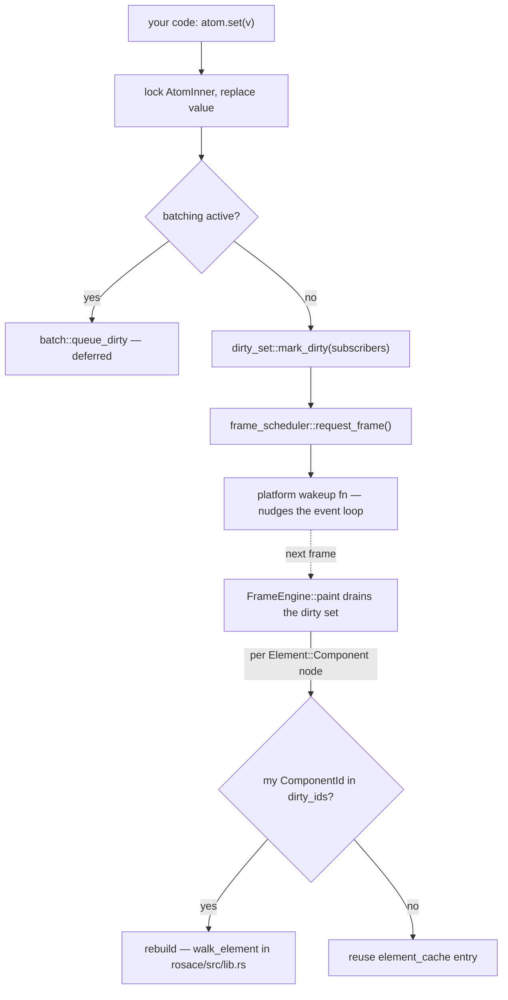

# State & Reactivity

> Covers `rosace-state` (Layer 1) — the reactive substrate `rosace-core` builds `Context::state` on top of. Read [core.md](core.md) first for the Atom/dirty-set overview; this chapter goes underneath it.

## In one sentence

Every [`Atom<T>`](../../rosace-state/src/atom.rs) ([glossary](../GLOSSARY.md#atom)) is a mutex-guarded value with a subscriber list; writing to it drops the subscribers' [component IDs](../GLOSSARY.md#componentid) into a global [dirty](../GLOSSARY.md#dirty) set and pokes the platform to render a frame, and that's the entire mechanism — there is no dependency graph, no virtual DOM diff, no scheduler thread.

## Mental model

Think of `rosace-state` as a **mailbox system**, not a spreadsheet. An atom doesn't know what *depends* on it in any structural sense — it just keeps a flat list of component IDs that asked to be notified, and on `set()` it drops all of their names into one shared "dirty" mailbox. Nobody computes a diff; the next frame just checks the mailbox and rebuilds whoever's name is in it.

## How it works

**1. An atom is a mutex around a value plus a subscriber list.** [`Atom<T>`](../../rosace-state/src/atom.rs) wraps `Arc<Mutex<AtomInner<T>>>`; `AtomInner` holds the value, a `Vec<ComponentId>` of subscribers, and an optional `on_change` callback. Cloning an `Atom` is cheap — every clone shares the same inner state, which is how an atom created in one `build()` call can be captured by a closure and still notify correctly. IDs come from a single global counter, [`next_atom_id`](../../rosace-state/src/atom_id_gen.rs) — a relaxed `AtomicU64` starting at 1, so IDs are unique but not meaningfully ordered.

**2. `Context::state` is a hook, not a field.** [`Context::state`](../../rosace-core/src/context.rs) calls [`hook_state(component_id, hook_index, default)`](../../rosace-state/src/state_store.rs), which looks up a thread-local `HashMap<(ComponentId, usize), Box<dyn Any>>` keyed by **call order within `build()`**. The first call for a given key creates the atom via `use_atom`; every later call re-subscribes the same atom and returns a clone. Re-subscribing every call is deliberate — `atom.subscribe()` is idempotent (`Vec::contains` before push), and it's what lets a component that lost its subscription (e.g. after a tree-shape change wiped `element_cache`) get re-registered on its very next build.

**3. `set()`/`update()` write, notify, and schedule — atomically per-call, not globally.** Both lock `AtomInner`, replace the value, clone out the subscriber list and any `on_change`, then **drop the lock before doing anything else** (dispatch happens outside the mutex, so a subscriber's `on_change` callback can safely read the same atom). If [`batch::is_batching()`](../../rosace-state/src/batch.rs) is true, the dirty notification is queued instead of dispatched; otherwise it goes straight to [`dirty_set::mark_dirty`](../../rosace-state/src/dirty_set.rs) followed by [`frame_scheduler::request_frame()`](../../rosace-state/src/frame_scheduler.rs).

**4. The dirty set is one global `Mutex<Option<HashSet<ComponentId>>>`.** [`dirty_set.rs`](../../rosace-state/src/dirty_set.rs) has three states baked into that `Option`: `None` means "globally dirty" (rebuild everything — the startup state, or after `reset_to_global_dirty()`), `Some(empty)` means "nothing dirty", `Some(ids)` means exactly those components need rebuilding. `take_dirty_components()` drains it once per frame, transitioning `None → Some(empty)` on the way — so the very first frame after startup is always a full rebuild.

**5. `batch()` collapses N writes into one dirty-set flush.** [`batch::batch(f)`](../../rosace-state/src/batch.rs) sets a thread-local flag, runs `f`, then drains a thread-local `Vec<(AtomId, Vec<ComponentId>)>` queue and calls `mark_dirty` once per queued entry plus a single `request_frame()` — so five `atom.set()` calls inside one `batch()` still schedule only one frame, but each atom's subscribers still land in the dirty set individually (there's no coalescing of *which* components are dirty, only of *when* the frame gets requested). [`Priority`](../GLOSSARY.md#priority) (`Immediate`/`Normal`/`Background`) is defined but not read anywhere in the batching path today — it's a plain enum, not yet wired to different scheduling behavior.

**6. `request_frame()` is how state reaches the platform.** [`frame_scheduler.rs`](../../rosace-state/src/frame_scheduler.rs) is a static `AtomicBool` plus a `OnceLock<Box<dyn Fn()>>` wakeup closure that `rosace-platform` installs once at startup via `register_wakeup`. Calling `request_frame()` sets the flag and invokes the wakeup closure, which sends a user event into the winit loop to break it out of `ControlFlow::Wait`. Multiple calls before the platform polls collapse into one redraw (`take_frame_requested` swaps the flag to `false` and returns whether it was set) — this is the mechanism [`FrameEngine::paint`](../../rosace/src/engine.rs) rides on to actually get invoked.

**7. Fine-grained rebuild happens in the element walker, not in `rosace-state`.** This is worth being precise about: `rosace-state` only tracks dirty **component IDs**; it has no idea about tree structure. The actual per-node rebuild-vs-reuse decision is [`walk_element`](../../rosace/src/lib.rs) in `rosace` (Layer 7): each `Element::Component` node gets a stable, position-based `ComponentId` (DFS order — see D001) and checks `global_dirty || subtree_dirty || dirty_ids.contains(&id)`. `subtree_dirty` is what makes an ancestor's rebuild cascade to its children without them being in the dirty set themselves — a plain boolean threaded down the recursive walk, not a graph query.

**8. `RefreshEngine` exists but is not wired into the frame loop.** [`RefreshEngine`](../../rosace-state/src/refresh_engine.rs) implements exactly what D011 describes — DFS entry/exit timestamps per component for O(1) ancestor queries, and `find_rebuild_roots()` to prune a dirty set down to the minimal set of roots whose rebuild already covers every other dirty descendant. It's fully implemented and unit-tested, but nothing outside `rosace-state`'s own tests and its re-export in `lib.rs` calls it — the production pruning behavior described in point 7 is achieved a different way (the `subtree_dirty` flag falling out of `walk_element`'s recursion), which gets the same *outcome* without needing the tree index. Don't assume `RefreshEngine` is on the hot path; grep before relying on it.

**9. Batching aside, some interaction state deliberately bypasses the reactive graph entirely.** [`scroll_offset.rs`](../../rosace-state/src/scroll_offset.rs) and [`pan_momentum.rs`](../../rosace-state/src/pan_momentum.rs) are thread-local `HashMap`s keyed by render-tree node id, not atoms. A GPU-composited scroll layer's offset changing calls `request_frame()` directly but **dirties no component** — the frame re-composites via a UV shift with no CPU repaint at all (see [render-pipeline.md](render-pipeline.md) and D090). This is a conscious escape hatch: routing scroll position through an `Atom` would rebuild the scrolling widget's subtree every frame of a fling.

**10. Persistence write-through rides the `on_change` slot.** [`Context::state_permanent`](../../rosace-core/src/context.rs) (D114/D121) is a plain `Context::state` underneath, plus a one-time check of a `bool` "wired" atom: on first mount it seeds from the persist backend (or `default` if absent), then calls `atom.set_on_change(...)` to write every future value back to storage. Because `Atom` only has **one** `on_change` slot (`set_on_change` replaces, not adds), registering your own callback on a `state_permanent` atom silently kills its persistence — see Gotchas.

**11. Cleanup and lifecycle are keyed the same way as hooks.** [`cleanup_store.rs`](../../rosace-state/src/cleanup_store.rs) is a thread-local `HashMap<ComponentId, Vec<CleanupFn>>` fed by `Context::on_cleanup`. The `FrameEngine` diffs `new_mounted` against `prev_mounted` each frame (see [`rosace/src/engine.rs`](../../rosace/src/engine.rs)) and for every ID that dropped out calls `cleanup_store::fire_and_clear` then `state_store::clear_component` — this is also what makes a component's hook slots start fresh if it remounts at the same tree position later.

**12. `AsyncState<T>` is a data shape, not a subscription mechanism.** [`async_state.rs`](../../rosace-state/src/async_state.rs) defines the five-state enum (`Idle`/`Loading`/`Success`/`Error`/`Refreshing`) from D009. There is no `use_async` hook implementation in this crate — it's the plain data type a future async-integration layer stores inside an `Atom<AsyncState<T>>`.

## Key types

- [`Atom<T>`](../../rosace-state/src/atom.rs) — the reactive cell: `get()`, `set()`, `update()`, `subscribe()`/`unsubscribe()`, `set_on_change()`.
- [`GlobalAtom<T>`](../../rosace-state/src/global_atom.rs) — a `const`-constructible, lazily-initialized app-wide atom for `static` declarations; no provider needed.
- [`dirty_set`](../../rosace-state/src/dirty_set.rs) — the single global `HashSet<ComponentId>` (wrapped in the tri-state `Option`) that every atom write feeds and every frame drains.
- [`frame_scheduler`](../../rosace-state/src/frame_scheduler.rs) — `request_frame()`/`take_frame_requested()`, the atomic flag + wakeup closure that bridges a state change to the platform event loop.
- [`hook_state`](../../rosace-state/src/state_store.rs) — the `(ComponentId, call-order)`-keyed store backing `Context::state`.
- [`batch`](../../rosace-state/src/batch.rs) — groups synchronous atom writes into one `request_frame()` call.
- [`RefreshEngine`](../../rosace-state/src/refresh_engine.rs) — DFS-timestamp ancestor index and dirty-root pruning; implemented and tested, **not currently called from the frame loop** (see point 8 above).
- [`scroll_offset`](../../rosace-state/src/scroll_offset.rs) / [`pan_momentum`](../../rosace-state/src/pan_momentum.rs) — non-reactive, node-id-keyed channels for state that must survive rebuilds without triggering them.

## Why it's like this

- **A flat subscriber list per atom, not a dependency graph.** [D006](../DECISIONS.md) picks `Atom<T>` as the single primitive precisely because it's the simplest thing that can work — no memoization graph to keep consistent, no diffing. [D011](../DECISIONS.md)'s "find dirty roots, prune descendants" algorithm is the intended shape of the optimization on top of that simple primitive; `RefreshEngine` is that algorithm, built and tested, waiting to be wired in (see point 8).
- **Hook-model keying (call order), not named/typed slots.** Chosen alongside `rosace-core`'s `Component` design (see [core.md](core.md)) so state stays colocated with the code that reads it, mirroring React hooks. The tradeoff is the same one React has: stable call order is an invariant you must not violate.
- **Batching is manual-opt-in plus automatic-within-`batch()`, not automatic everywhere.** [D010](../DECISIONS.md) treats "multiple atoms changing = one logical operation = one rebuild" as something the caller usually knows better than the framework can infer — hence an explicit `batch(|| { ... })` rather than an implicit microtask-queue flush.
- **Persistence tiers are opt-in and hook-based, not a separate storage API.** [D008](../DECISIONS.md) defines the four tiers (`reload`/`session`/`permanent`/`encrypted`); [D114/D121](../DECISIONS.md) (in `.steering/DECISIONS.md`) re-homes `permanent` onto `Context::state_permanent` specifically so it composes with the existing hook model instead of inventing a parallel persistence API — `reload` and `session` remain documented no-ops until hot-reload (D102) exists.
- **Scroll/pan state deliberately lives outside the atom system.** This is the concrete tradeoff behind D090's "scroll produces no CPU paint" goal: an `Atom`-backed scroll position would correctly notify subscribers, but every subscriber notification means a rebuild, and a 60fps fling cannot afford to rebuild the scrolling subtree every frame just to move pixels the GPU can shift with a UV offset.

## Gotchas & invariants

- **`Atom::set_on_change` has exactly one slot.** Registering your own `on_change` on a `Context::state_permanent` atom silently replaces its persistence write-through — the atom stops saving, with no error. Don't add a second `on_change` to a persistent atom; compose behavior another way (e.g. wrap `set()` at the call site).
- **`RefreshEngine`'s pruning is not what actually runs.** If you're debugging why a component did or didn't rebuild, the real logic is `walk_element`'s `subtree_dirty` propagation in [`rosace/src/lib.rs`](../../rosace/src/lib.rs), not `RefreshEngine::find_rebuild_roots`. The latter is real, tested code — just not on the hot path yet.
- **The dirty set's `None` state means "rebuild absolutely everything," triggered by `reset_to_global_dirty()`.** This isn't just a startup detail — it's called whenever the tree shape changes in a way that invalidates the element cache (a component type mismatch during reconciliation). If you see an unexpected full-tree rebuild, look for a call to `reset_to_global_dirty()`, not a burst of individual `atom.set()` calls.
- **`atom.set()` inside `build()` is a footgun, not a `rosace-state` bug.** Nothing in `Atom`/`dirty_set` prevents a rebuild loop — `set()` inside `build()` marks the component dirty again, and the next frame rebuilds it again. This is a `rosace-core`-level discipline (see [core.md](core.md)'s gotchas), enforced by convention, not by this crate.
- **`Priority` (`Immediate`/`Normal`/`Background`) is currently decorative.** The type exists per D010 but `batch()`'s actual dispatch path doesn't branch on it — don't assume choosing `Priority::Background` changes scheduling behavior today.
- **`scroll_offset`/`pan_momentum` are thread-local and main-thread-only by design.** Both doc comments say so explicitly — they rely on event dispatch and present both running on the main thread, mirroring the widget-side render-tree registries. Don't try to update them from a background thread.
- **Hook slots are cleared on unmount, not on every frame.** `state_store::clear_component` only runs when the `FrameEngine` detects a `ComponentId` dropped out of `new_mounted` between frames — a component that stays mounted keeps its hook slots (and thus its atoms) stable across rebuilds, which is the entire point of the hook model.
