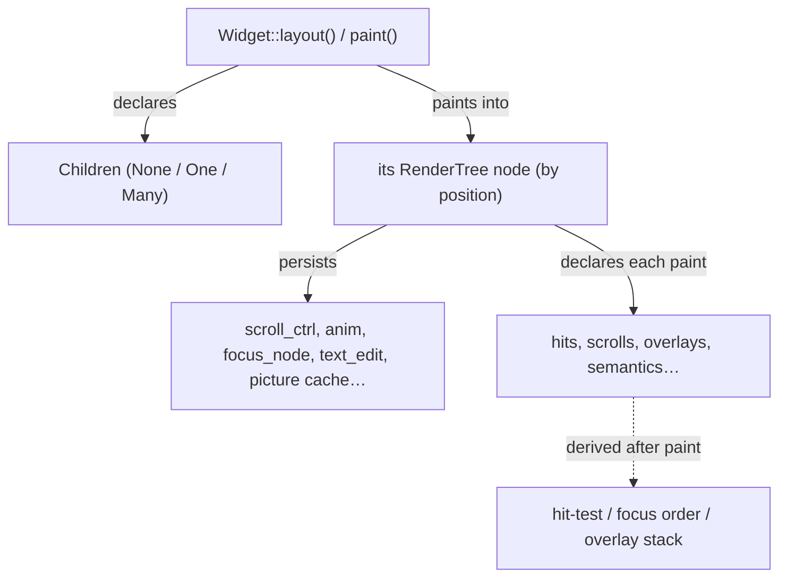

# Widget Protocol: `Widget`, `Children`, the Render Tree

> Covers `rosace-widgets` (Layer 6) — the low-level render/paint contract every built-in widget implements, and the arena that gives it persistent per-node state.

## In one sentence

A `Widget` is a small object that knows how to measure itself, draw itself, and declare its children; the framework arranges these into a persistent, position-keyed tree (the `RenderTree`) so each widget's interactive and cached state survives from one frame to the next.

## Mental model

If [core.md](core.md) is "what you write" (`Component::build()` returning an `Element`), `Widget` is "what actually gets measured and painted." A `Component` is a recipe; a `Widget` (`Column`, `Text`, `Button`, …) is the dish. Every `Widget` occupies exactly one slot in the `RenderTree`, keyed by its **position** in paint order — not by identity or a key — so the tree looks and behaves like a flat, positionally-addressed array of "boxes that remember things between frames":



## How it works

**1. Every built-in widget implements [`Widget`](../../rosace-widgets/src/tree/mod.rs).** The trait has four methods, all with sensible defaults:

```rust
pub trait Widget: Send + Sync {
    fn children(&self) -> Children<'_> { Children::None }
    fn layout(&self, ctx: &LayoutCtx) -> Size { /* default from children() */ }
    fn paint(&self, ctx: &mut PaintCtx) { /* default from children() */ }
    fn flex_factor(&self) -> f32 { /* transparent by default */ }
}
```
[`rosace-widgets/src/tree/mod.rs`](../../rosace-widgets/src/tree/mod.rs)

**2. `children()` is the taxonomy every default keys off (D098).** [`Children`](../../rosace-widgets/src/tree/mod.rs) is one of three shapes:
- `None` — a leaf (`Text`, `Icon`, `Divider`…): the default `layout`/`paint` draw nothing extra.
- `One(&dyn Widget)` — a single-child wrapper (`Container`, `Padding`, `RepaintBoundary`…): defaults to "delegate to the child" for layout, paint, and even `flex_factor`.
- `Many(&[BoxedWidget])` — a multi-child container (`Column`, `Row`, `Stack`…): defaults to stack-like behavior; real containers override `layout`/`paint` to actually position children.

A wrapper widget therefore only has to implement the one method it changes — declare `children()` and inherit the rest.

**3. `Box<dyn Widget>` is itself a `Widget`** ([D093](../../rosace-widgets/src/tree/mod.rs), the "Constructor Law") — builders that accept `impl Widget` can take already-boxed children with zero adapter structs; it's pure transparent delegation, not an extra tree node.

**4. Every widget owns a slot in the [`RenderTree`](../../rosace-widgets/src/tree/render_tree.rs) — a flat arena, not a nested struct.** [`RenderTree::slot(parent, reset)`](../../rosace-widgets/src/tree/render_tree.rs) hands back the `NodeId` for "the next child of `parent`, in paint order." Identity is **positional**: the *n*-th child painted under a given parent this frame is the *n*-th child forever, regardless of which widget type currently occupies that slot. This is what D091 calls out explicitly — it's cheap and simple, but it is also the reason virtualized/recycled lists need special care (see Gotchas).

**5. A [`TreeNode`](../../rosace-widgets/src/tree/render_tree.rs) carries two very different kinds of data.** *Declared* data (`hits`, `scrolls`, `overlays`, `focus`, `semantics`, `editable`, `pointer_mode`, `hover_regions`) is cleared and re-declared on every repaint of that node (`RenderTree::begin`) — a widget's `paint()` pushes onto these every time it runs. *Persistent* data (`scroll_ctrl`, `anim`, `focus_node`, `text_edit`, the picture cache: `cached_picture`/`cached_size`/`cached_rect`) survives untouched across repaints, and critically, **survives cache-hit frames where `paint()` doesn't even run** — this is the actual bug class D091 exists to make unrepresentable (see Why it's like this).

**6. The frame walker derives everything else from the tree after paint.** [`RenderTree::hit_test`](../../rosace-widgets/src/tree/render_tree.rs) walks children-before-own-regions, later-siblings-first, so the topmost widget in paint order (= z-order) wins a click — no separate z-index bookkeeping. Scroll routing, the overlay stack, and the accessibility tree (`collect_semantics`, D099) are all similarly *derived* from what got declared onto nodes this frame, not pushed through side channels.

**7. `Element::Native` is the bridge from `rosace-core`'s tree to a `Widget`.** [`Widget::into_element()`](../../rosace-widgets/src/tree/mod.rs) wraps `self` in a `WidgetBox` and stores it as the payload of a `NativeElement`. The umbrella crate's element walker ([`walk_element`](../../rosace/src/lib.rs)) downcasts that payload back to a [`WidgetBox`](../../rosace-widgets/src/tree/mod.rs), calls `RenderTree::slot()` to get (or create) that position's node, and — only if the node's cache says it's dirty — calls `layout()`/`paint()` on the widget. A slot consumed with `reset == false` (a picture-cache hit) skips repainting entirely but still consumes the position, keeping siblings aligned and the skipped subtree's state fully intact.

**8. `PaintCtx` and `LayoutCtx` are the per-call handles a `Widget` gets.** [`LayoutCtx`](../../rosace-widgets/src/tree/mod.rs) carries `constraints` + font/theme access so widgets measure text accurately instead of guessing. [`PaintCtx`](../../rosace-widgets/src/tree/mod.rs) carries the paint rect, the shared `Rc<RefCell<RenderTree>>`, and the `NodeId` this call owns — it's how a widget's `paint()` reaches its own persistent node (`ctx.animate_to`, `ctx.focus_node()`, declaring a `hit`, etc.).

**9. `WidgetApp` is the headless renderer used for golden/snapshot tests.** [`rosace-widgets/src/tree/app.rs`](../../rosace-widgets/src/tree/app.rs) lays out and paints a widget tree to an in-memory `SkiaCanvas` (or PNG bytes) without a window — the same `Widget::layout`/`paint` calls a real app makes, just driven directly instead of through `App::launch`.

## Key types

- [`Widget`](../../rosace-widgets/src/tree/mod.rs) — the render-layer trait: `children`, `layout`, `paint`, `flex_factor`.
- [`Children`](../../rosace-widgets/src/tree/mod.rs) — `None | One | Many`, the taxonomy every default behavior keys off (D098).
- [`BoxedWidget`](../../rosace-widgets/src/tree/mod.rs) — `Box<dyn Widget>`, itself a `Widget` (D093).
- [`RenderTree` / `TreeNode` / `NodeId`](../../rosace-widgets/src/tree/render_tree.rs) — the position-keyed arena; the single owner of all per-node retained state (D091).
- [`PaintCtx` / `LayoutCtx`](../../rosace-widgets/src/tree/mod.rs) — the per-call contexts a widget's `layout`/`paint` receive.
- [`WidgetBox`](../../rosace-widgets/src/tree/mod.rs) — bridges a `Box<dyn Widget>` into `rosace-core`'s `Element` tree as a `NativeElement` payload.
- [`WidgetApp`](../../rosace-widgets/src/tree/app.rs) — headless widget-tree renderer for golden tests.
- [`Template` / `TemplateNode`](../../rosace-widgets/src/template/descriptor.rs) — the *data* form of a widget subtree, used for hot reload (see [hot-reload.md](hot-reload.md)); a separate, parallel path from the `Widget` trait itself.

## Why it's like this

- **D091 — RenderTree owns all per-node retained state.** Before this, hit handlers, `TransformLayerEntry`s, and overlay entries each got their own bolt-on cache and each broke the same way: something produced only during `paint()` silently vanished on a cache-hit frame where `paint()` didn't run. Making the tree the single owner of persistent state makes that bug class unrepresentable, and gives damage-rect repainting and `RepaintBoundary` caching a real foundation. See [D091 in DECISIONS.md](../DECISIONS.md).
- **D092 — tree-walk hit testing with structural z-order.** Paint order already *is* z-order, so deriving hit-test order from the tree (children first, later siblings win) means there's no separate z-index concept to keep in sync.
- **D098 — two-concept model + taxonomy by defaults.** Splitting "declare structure" (`children()`) from "do the work" (`layout`/`paint`) means a wrapper widget writes one method instead of four, and the *default* is correct for the overwhelming majority of wrapper widgets in the tree.
- **D093 — the Constructor Law (`Box<dyn Widget>` is a `Widget`).** Lets builder APIs accept `impl Widget` uniformly, whether the caller has a concrete widget or an already-boxed one, without a wrapper type.
- **D100 — `CustomPaint` is a recorded leaf, not raw pixel access.** Even the escape hatch for custom drawing stays inside the retained-command pipeline (`DrawCommand`s recorded through `PaintCtx`), rather than touching a canvas directly — the same reasoning as D091: nothing should exist only during one frame's `paint()` call that the rest of the system can't see.

## Gotchas & invariants

- **Node identity is positional, not by widget identity or key.** The *n*-th child painted under a parent this frame gets slot *n* — permanently, until the tree shape changes. A `Widget` that appears/disappears conditionally shifts every later sibling's identity, the same "stable call order" rule `Context::state` has in `rosace-core` (see [core.md](core.md)).
- **Virtualized/recycled containers are the sharp edge of positional identity.** `ListView` only builds/paints viewport-visible rows each frame via `ctx.child(row_rect)` → `RenderTree::slot()`; as the visible window scrolls, a given *slot* (and its persisted `anim` field) gets silently reassigned to whatever row currently lands there — NOT to the same underlying data item. This is a confirmed, currently-open gap (see [D111 in DECISIONS.md](../DECISIONS.md), Known Issue #11), not a hypothetical: it's why "give every widget default animation" was reverted rather than shipped universally.
- **`Children::None`/`One`/`Many` isn't just documentation — every unspecified `layout`/`paint`/`flex_factor` derives from it.** Get the taxonomy wrong (e.g. declare `Many` for what's really a single-child wrapper) and you silently inherit stack-layout behavior instead of delegation.
- **Declared data is wiped every repaint; persistent data is not.** If you're debugging "my hit region disappeared," check whether the node actually repainted this frame (declared data only survives while `paint()` keeps re-declaring it) versus whether persistent state (like `scroll_ctrl`) unexpectedly reset (which would mean the node's identity changed, i.e. the positional-slot problem above).
- **`CustomPaint` cannot touch a canvas directly** — no raw pixel access at paint time is allowed, by design (D100); pixel-level needs go through `DrawCommand::BlitRgba`. This is a deliberate constraint, not a missing feature.
